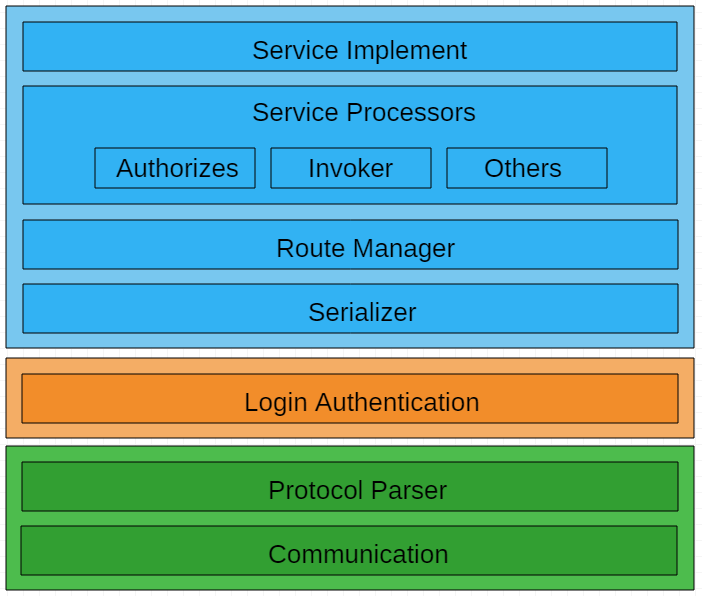
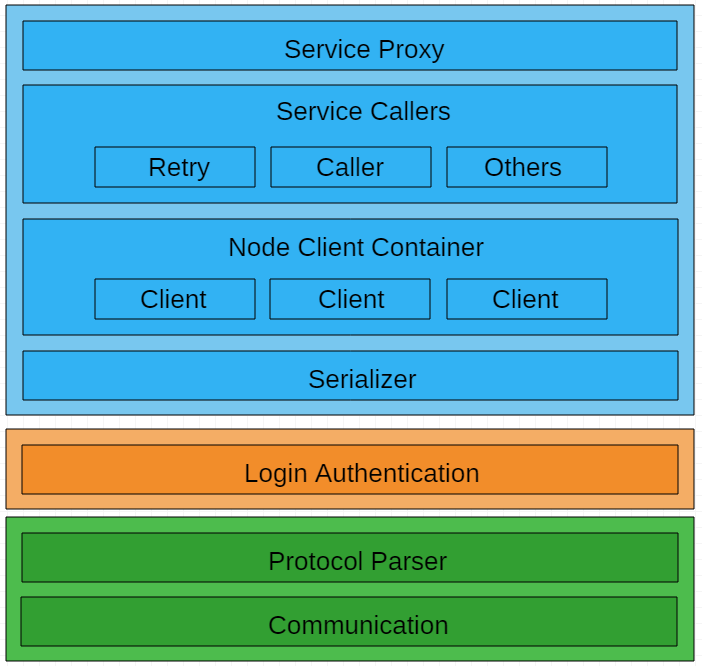
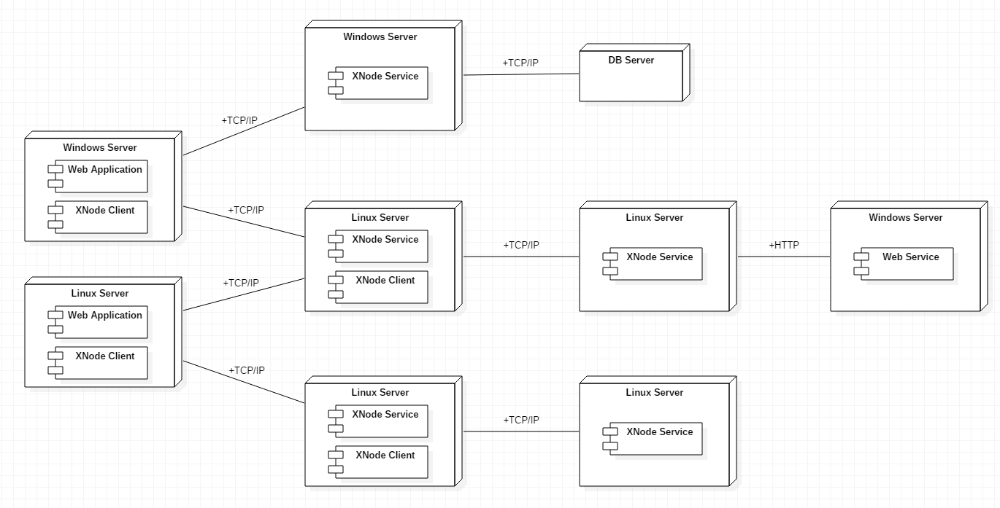
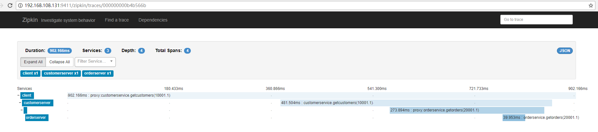

# XNode 开发指南
<!-- TOC -->

- [XNode 开发指南](#xnode-开发指南)
    - [简介](#简介)
        - [XNode服务端架构图](#xnode服务端架构图)
        - [XNode客户端架构图](#xnode客户端架构图)
        - [XNode部署图](#xnode部署图)
        - [XNode通信协议](#xnode通信协议)
    - [第一个XNode服务](#第一个xnode服务)
        - [实现XNode服务](#实现xnode服务)
        - [实现XNode代理](#实现xnode代理)
        - [运行](#运行)
        - [完整示例代码](#完整示例代码)
    - [使用AOP技术使服务调用透明化](#使用aop技术使服务调用透明化)
        - [使用Autofac改进XNode代理](#使用autofac改进xnode代理)
        - [运行](#运行-1)
        - [服务端对Autofac的支持](#服务端对autofac的支持)
        - [完整示例代码](#完整示例代码-1)
    - [实体](#实体)
        - [创建作为参数的实体](#创建作为参数的实体)
        - [创建作为返回值的实体](#创建作为返回值的实体)
        - [完整示例代码](#完整示例代码-2)
    - [序列化](#序列化)
        - [修改服务端序列化组件](#修改服务端序列化组件)
        - [修改客户端序列化组件](#修改客户端序列化组件)
        - [运行](#运行-2)
        - [完整示例代码](#完整示例代码-3)
    - [服务和代理的启用与禁用](#服务和代理的启用与禁用)
        - [服务启用/禁用](#服务启用禁用)
            - [使用Attribute的方式设置](#使用attribute的方式设置)
            - [使用配置文件的方式设置](#使用配置文件的方式设置)
        - [代理启用/禁用](#代理启用禁用)
            - [使用Attribute的方式设置](#使用attribute的方式设置-1)
            - [使用配置文件的方式设置](#使用配置文件的方式设置-1)
        - [完整示例代码](#完整示例代码-4)
    - [服务身份验证](#服务身份验证)
        - [使用默认身份验证](#使用默认身份验证)
        - [完整示例代码](#完整示例代码-5)
    - [服务授权](#服务授权)
        - [使用默认服务授权](#使用默认服务授权)
        - [完整示例代码](#完整示例代码-6)
    - [服务追踪](#服务追踪)
        - [示例结构](#示例结构)
        - [Contract实现](#contract实现)
        - [Service实现](#service实现)
        - [OrderServer实现](#orderserver实现)
        - [CustomerServer实现](#customerserver实现)
        - [Client实现](#client实现)
        - [运行](#运行-3)
        - [完整示例代码](#完整示例代码-7)
    - [服务发现](#服务发现)
        - [服务端配置](#服务端配置)
        - [客户端配置](#客户端配置)
        - [完整示例代码](#完整示例代码-8)  
    - [扩展点](#扩展点)
        - [服务端扩展接口](#服务端扩展接口)
        - [客户端扩展接口](#客户端扩展接口)
    - [应对服务中断](#应对服务中断)
        - [客户端轮循访问服务](#客户端轮循访问服务)
        - [客户端被动关闭处理策略](#客户端被动关闭处理策略)
    - [Demo解析](#demo解析)
        - [Demo介绍](#demo介绍)
        - [Entity](#entity)
        - [Contract](#contract)
        - [Repository](#repository)
        - [Service](#service)
        - [Web](#web)
            - [DTO定义](#dto定义)
            - [服务/代理注册](#服务代理注册)
            - [Controller实现](#controller实现)
        - [Launcher](#launcher)
        - [运行](#运行-4)
        - [完整示例代码](#完整示例代码-9)
    - [技术交流](#技术交流)

<!-- /TOC -->
## 简介
XNode是基于.Net Standard 2.0开发的轻量级分布式服务框架，它提供了通过少量代码及简单配置即可实现分布式部署的能力。XNode对业务代码的侵入性较小，通过一些配置以及将指定的Attribute应用在服务接口及实体上就能使XNode服务正常运行，当开发者想更换其它分布式框架时只需要进行一些少量的修改。XNode提供了本地/远程调用透明化的能力，开发人员调用一个XNode服务与调用本地服务没有区别，当需要将一个本地服务部署到远程机器时，只需修改相应的配置而不需要对现有代码进行任何修改。XNode也提供了一些扩展点以便开发人员能够根据实际需要对功能进行扩展，例如权限、服务跟踪等。

### XNode服务端架构图


### XNode客户端架构图


### XNode部署图


### XNode通信协议
<table>
<tr><td style="width: 80px">起始字节</td><td style="width: 80px">长度</td><td>说明</td></tr>
<tr><td>0</td><td>4</td><td>校验码（32位，暂未使用）</td></tr>
<tr><td>4</td><td>4</td><td>消息总长度（32位），包括消息头与消息体</td></tr>
<tr><td>8</td><td>8</td><td>请求ID（64位）</td></tr>
<tr><td>16</td><td>1</td><td>消息类型（8位），0：业务请求消息，1：业务响应消息，2：业务ONE WAY消息，3：握手请求消息，4：握手应答消息，5：心跳请求消息，6：心跳应答消息</td></tr>
<tr><td>17</td><td>1</td><td>消息优先级（8位，暂未使用）</td></tr>
<tr><td>18</td><td>4</td><td>附加数据数量</td></tr>
<tr><td>22</td><td>可变</td><td>附加数据，用于扩展消息头，key长度（UTF-8编码后）+key（UTF-8编码后）+value长度+value</td></tr>
<tr><td>22+附加数据长度</td><td>4</td><td>消息体长度</td></tr>
<tr><td>22+附加数据长度+4</td><td>消息体长度</td><td>消息体</td></tr>
</table>

## 第一个XNode服务
本节将创建一个简单的XNode服务，使开发者对XNode有个直观的认识，后续的章节将对细节进行叙述。

### 实现XNode服务
首先创建一个名为Server的.Net Core 2.0控制台项目，在这个项目中将实现XNode服务。

在Server项目中通过Nuget引入以下依赖项：
XNode
XNode.Serializer.ProtoBuf
XNode.Communication.DotNetty
Microsoft.Extensions.Configuration.Binder
Microsoft.Extensions.Configuration.Json
Microsoft.Extensions.Logging.Console

创建SampleService.cs文件并加入以下代码：
``` c#
[Service("SampleService", 10001, true)]
public interface ISampleService
{
    [Action("Welcome", 1)]
    string Welcome(string name);
}

public class SampleService : ISampleService
{
    public string Welcome(string name)
    {
        return $"Hello {name}";
    }
}
```
以上代码实现了名为SampleService的服务接口，并在接口上通过Attribute指定为XNode服务。

创建config.json文件并加入以下配置：
``` javascript
{
  "xnode": {
    "server": {
      "serverInfo": {
        "host": "192.168.37.131",
        "port": "9001"
      }
    }
  }
}
```
这段是XNode最基本的配置，XNode服务对外公开的IP与端口，开发者可以根据自己机器的实际情况对上面的配置进行修改。

打开Program.cs文件并加入以下代码：
``` c#
class Program
{
    static void Main(string[] args)
    {
        Console.InputEncoding = Encoding.UTF8;
        Console.OutputEncoding = Encoding.UTF8;

        //配置服务端日志工厂
        LoggerManager.ServerLoggerFactory.AddConsole(LogLevel.Error);

        //加载配置文件
        string path = Path.Combine(Directory.GetCurrentDirectory(), "config.json");
        var configRoot = new ConfigurationBuilder()
            .AddJsonFile(path)
            .Build();

        var serverConfig = configRoot.GetServerConfig();

        //配置服务
        var nodeServer = new NodeServerBuilder()
            .ApplyConfig(serverConfig)
            .ConfigSerializer(new ProtoBufSerializer(LoggerManager.ServerLoggerFactory))
            .ConfigServiceProvider(GetServiceProvider())
            .UseDotNetty(serverConfig.ServerInfo)
            .Build();

        //启动服务
        nodeServer.StartAsync().Wait();

        Console.ReadLine();

        //关闭服务
        nodeServer.StopAsync();
    }

    private static XNode.Server.IServiceProvider GetServiceProvider()
    {
        //注册服务
        return new DefaultServiceProvider()
            .RegistService(typeof(ISampleService), typeof(SampleService));
    }
}
```
这段代码配置了服务使用的序列化组件以及对服务进行注册并且使用DotNetty作为底层通信组件，然后启动服务，在输入回车后则关闭服务。至此服务端已开发完毕。

### 实现XNode代理
下面再创建一个名为Client的.Net Core 2.0控制台项目，在这个项目中将实现一个客户端来调用XNode服务。

在Client项目中通过Nuget引入以下依赖项： 
XNode
XNode.Serializer.ProtoBuf
XNode.Communication.DotNetty
Microsoft.Extensions.Configuration.Binder
Microsoft.Extensions.Configuration.Json
Microsoft.Extensions.Logging.Console

创建ISampleService.cs文件并加入以下代码：
``` c#
[ServiceProxy("SampleService", 10001)]
public interface ISampleService
{
    [ActionProxy("Welcome", 1)]
    string Welcome(string name);
}
```
以上代码通过XNode提供的Attribute实现了SampleService的代理接口。

创建config.json文件并加入以下配置：
``` javascript
{
  "xnode": {
    "client": {
      "serviceProxies": [
        {
          "proxyName": "SampleService",
          "connections": [
            {
              "host": "192.168.37.131",
              "port": "9001",
              "localHost": "192.168.37.131"
            }
          ],
          "services": [
            {
              "serviceId": 10001,
              "enabled": true
            }
          ],
          "proxyTypes": [
            "Client.ISampleService,Client"
          ]
        }
      ]
    }
  }
}
```
以上对XNode代理进行了配置，指定SampleService所在的服务器IP与端口，配置了服务Id为10001的代理类并设置为开启状态。connections配置节可以配置多个连接信息，默认情况下XNode代理会轮流访问这些服务器以起到负载均衡的作用。

打开Program.cs文件并加入以下代码：
``` c#
class Program
{
    static void Main(string[] args)
    {
        Console.WriteLine("Please input enter to begin.");
        Console.ReadLine();

        Console.InputEncoding = Encoding.UTF8;
        Console.OutputEncoding = Encoding.UTF8;

        //配置客户端日志工厂
        LoggerManager.ClientLoggerFactory.AddConsole(LogLevel.Error);

        //加载配置文件
        string path = Path.Combine(Directory.GetCurrentDirectory(), "config.json");
        var configRoot = new ConfigurationBuilder()
            .AddJsonFile(path)
            .Build();

        var clientConfig = configRoot.GetClientConfig();

        var serializer = new ProtoBufSerializer(LoggerManager.ClientLoggerFactory);

        var serviceProxyManager = new ServiceProxyManager();

        if (clientConfig.ServiceProxies != null)
        {
            //注册服务代理
            foreach (var config in clientConfig.ServiceProxies)
            {
                var serviceProxy = new ServiceProxy(
                    config.ProxyName,
                    config?.Services)
                    .AddServices(config.ProxyTypes)
                    .AddClients(
                        new NodeClientBuilder()
                            .ConfigConnections(config.Connections)
                            .ConfigSerializer(serializer)
                            .UseDotNetty()
                            .Build()
                    );
                serviceProxyManager.Regist(serviceProxy);
            }
        }

        try
        {
            //连接服务
            serviceProxyManager.ConnectAsync().Wait();
        }
        catch (AggregateException ex)
        {
            foreach (var e in ex.InnerExceptions)
            {
                if (e is NetworkException netEx)
                {
                    Console.WriteLine($"Connect has net error. Host={netEx.Host}, Port={netEx.Port}, Message={netEx.Message}");
                }
                else
                {
                    throw e;
                }
            }
        }

        try
        {
            //调用服务
            var serviceProxy = serviceProxyManager.GetServiceProxy(typeof(ISampleService));
            var result = serviceProxy.CallRemoteServiceAsync(GetSampleServiceActionType("Welcome"), new object[] { "XNode" }).Result as string;
            Console.WriteLine(result);
        }
        catch (RequestTimeoutExcption ex)
        {
            Console.WriteLine($"Timeout: RequestId={ex.Request.Id}");
        }
        catch (ServiceCallException ex)
        {
            Console.WriteLine($"Service call exception: ExceptionId={ex.ExceptionId}, ExceptionMessage={ex.Message}");
        }
        catch (Exception ex)
        {
            Console.WriteLine($"Error: {ex.Message}");
        }

        Console.ReadLine();

        //关闭服务连接
        serviceProxyManager.CloseAsync();
    }

    private static MethodInfo GetSampleServiceActionType(string methodName)
    {
        var serviceType = typeof(ISampleService);
        return serviceType.GetMethod(methodName);
    }
}
```
这段代码注册了服务代理，然后连接服务并进行调用，在输入回车后则关闭连接。至此客户端也开发完毕了。

### 运行
对Server与Client进行编译并启动，然后在Client中输入回车后将会对Server中的XNode服务进行调用，若调用正常将在Client显示服务返回的结果：Hello XNode。

### 完整示例代码
XNode-Sample/01-QuickStart

## 使用AOP技术使服务调用透明化
在前面的示例中，客户端调XNode服务的过程当中暴露了一些技术细节，显然这些细节比较繁琐且不应该出现在业务代码中。通过使用AOP技术可以将这些细节封装起来，使得在业务代码调用XNode服务与调用本地接口方法一样。.Net平台下有多种支持AOP组件，XNode默认提供了对Autofac的支持，下面看一下如何使用Autofac改进XNode服务调用。

### 使用Autofac改进XNode代理
这里我们在上一个示例的基础进行改进，Server部分的代码不需要进行任何修改，Client部分需要通过Nuget引入新的依赖项：
XNode.Autofac

新增一个类文件SampleService.cs：
``` c#
public class SampleService : ISampleService
{
    public string Welcome(string name)
    {
        throw new NotImplementedException();
    }
}
```
在本例中，这个类不需要任何实现，它只是被用于注册到Autofac容器中。在实际项目开发过程中，可以把真正业务逻辑实现在类中，以便在调用服务时实现本地/远程透明化，详细情况会在后续的章节中叙述。

打开Program.cs文件，首先在创建ServiceProxyManager实例之后加上创建Autofac容器的代码：
``` c#
var serviceProxyManager = new ServiceProxyManager();

//创建Autofac容器并注册服务类型
var container = GetAutofacContainer(serviceProxyManager);
```
GetAutofacContainer方法用于创建Autofac容器与服务注册，下面是这个方法的实现：
``` c#
private static IContainer GetAutofacContainer(IServiceProxyManager serviceProxyManager)
{
    var builder = new ContainerBuilder();
    builder.Register(c => new ServiceProxyInterceptor(serviceProxyManager));
    builder.RegisterType<SampleService>()
        .As<ISampleService>()
        .EnableInterfaceInterceptors()
        .InterceptedBy(typeof(ServiceProxyInterceptor))
        .SingleInstance();

    var container = builder.Build();
    return container;
}
```
在这个方法中，ServiceProxyInterceptor类实现了Autofac拦截器接口。当服务代理被调用时通过拦截器以及配置可以决定代理调用的是本地实现还是远程服务。将它注册到Autofac容器后所有作为XNode服务代理的接口都需要通过InterceptedBy方法指定拦截器。

最后，看一下改进后如何调用XNode服务：
``` c#
try
{
    //调用服务
    var sampleService = container.Resolve<ISampleService>();
    var result = sampleService.Welcome("XNode");
    Console.WriteLine(result);
}
catch (RequestTimeoutExcption ex)
{
    Console.WriteLine($"Timeout: RequestId={ex.Request.Id}");
}
catch (ServiceCallException ex)
{
    Console.WriteLine($"Service call exception: ExceptionId={ex.ExceptionId}, ExceptionMessage={ex.Message}");
}
catch (Exception ex)
{
    Console.WriteLine($"Error: {ex.Message}");
}
```
正如代码所示，此时调用XNode服务与调用本地接口方法已经没有区别，后面的章节还会介绍通过配置灵活地切换调用本地实现或远程XNode服务。

### 运行
对Server与Client进行编译并启动，然后在Client中输入回车后将会对Server中的XNode服务进行调用，若调用正常将在Client显示服务返回的结果：Hello XNode。

### 服务端对Autofac的支持
前面演示了XNode客户端代理如何使用Autofac的AOP功能简单化对服务的调用。同样，XNode服务端也提供了对Autofac的支持，开发人员只需要将服务注册到Autofac容器中，不需要重复的在XNode中再次注册。引入XNode服务端对Autofac的支持只需要在配置服务器的时候调用UseAutofac方法即可：
``` c#
......
//配置服务
var nodeServer = new NodeServerBuilder()
    .ApplyConfig(serverConfig)
    .ConfigSerializer(new ProtoBufSerializer(LoggerManager.ServerLoggerFactory))
    //.ConfigServiceProvider(GetServiceProvider())      //默认的服务注册不需要了
    .UseAutofac(container, LoggerManager.ServerLoggerFactory)      //增加Autofac支持
    .UseDotNetty(serverConfig.ServerInfo)
    .Build();
......
```
代码中去除了默认的服务注册，增加了对UseAutofac方法的调用并传入Autofac容器，这样XNode服务端会自动从Autofac容器中找到XNode服务并进行注册。

### 完整示例代码
XNode-Sample/02-AOP

## 实体
在前面的示例中，参数与返回值都是简单类型，XNode也支持传递复杂类型作为参数与返回值。下面看一下如何使用复杂类型作为参数与返回值。

### 创建作为参数的实体
依然接着前面的示例，因为实体的定义对于服务端和客户端是一样的，所以新建一个名为Entity项目，并新建一个名为Name的类。
``` c#
[DataContract]
public class Name
{
    [DataMember(Order = 1)]
    public string FirstName { get; set; }

    [DataMember(Order = 2)]
    public string LastName { get; set; }
}
```
在实体类与属性上分别使用XNode序列化器可以识别的Attribute。目前XNode支持的序列化器ProtoBuf和MsgPack都可识别DataContract和DataMember，若使用其它的序列化器可能会有所不同。DataMember的Order属性为进行二进制序列化时的顺序，为了同时兼容这2种序列组件以便于未来可以无缝替换建议从1作为起始进行设置。

修改服务端接口与服务代码，使用Name类作为参数：
``` c#
[Service("SampleService", 10001, true)]
public interface ISampleService
{
    [Action("Welcome", 1)]
    string Welcome(Name name);
}

public class SampleService : ISampleService
{
    public string Welcome(Name name)
    {
        return $"Hello {name.FirstName} {name.LastName}";
    }
}
```
相应的也修改客户端代码：
``` c#
[ServiceProxy("SampleService", 10001)]
public interface ISampleService
{
    [ActionProxy("Welcome", 1)]
    string Welcome(Name name);
}

public class SampleService : ISampleService
{
    public string Welcome(Name name)
    {
        throw new NotImplementedException();
    }
}
```
最后对服务调用代码进行修改：
``` c#
//调用服务
var sampleService = container.Resolve<ISampleService>();
var result = sampleService.Welcome(new Name() { FirstName = "Michael", LastName = "Sun" });
Console.WriteLine(result);
```
对Server与Client进行编译并启动，然后在Client中输入回车后将会对Server中的XNode服务进行调用，若调用正常将在Client显示服务返回的结果：Hello Michael Sun。

### 创建作为返回值的实体
返回值实体与参数实体的创建方法一样，下面在Entity项目中新建2个类Order和OrderDetail。
``` c#
[DataContract]
public class Order
{
    [DataMember(Order = 1)]
    public int Id { get; set; }

    [DataMember(Order = 2)]
    public int CustomerId { get; set; }

    [DataMember(Order = 3)]
    public string CustomerName { get; set; }

    [DataMember(Order = 4)]
    public List<OrderDetail> Detail { get; set; }
}

[DataContract]
public class OrderDetail
{
    [DataMember(Order = 1)]
    public int OrderId { get; set; }

    [DataMember(Order = 2)]
    public int GoodsId { get; set; }

    [DataMember(Order = 3)]
    public string GoodsName { get; set; }

    [DataMember(Order = 4)]
    public decimal Price { get; set; }

    [DataMember(Order = 5)]
    public int Amount { get; set; }
}
```
在Server项目中的ISampleService接口中增加GetOrders方法：
``` c#
[Service("SampleService", 10001, true)]
public interface ISampleService
{
    [Action("Welcome", 1)]
    string Welcome(Name name);

    [Action("GetOrders", 2)]
    Task<IList<Order>> GetOrders();
}
```
同时在SampleService类中实现这个方法：
``` c#
public Task<IList<Order>> GetOrders()
{
    return Task.FromResult<IList<Order>>(new List<Order>()
    {
        new Order()
        {
            Id = 1,
            CustomerId = 1,
            CustomerName = "Customer1",
            Detail = new List<OrderDetail>()
            {
                new OrderDetail()
                {
                    OrderId = 1,
                    GoodsId = 1,
                    GoodsName = "A",
                    Price = 12,
                    Amount = 10
                },
                new OrderDetail()
                {
                    OrderId = 1,
                    GoodsId = 2,
                    GoodsName = "B",
                    Price = 26.5M,
                    Amount = 1
                },
                new OrderDetail()
                {
                    OrderId = 1,
                    GoodsId = 3,
                    GoodsName = "C",
                    Price = 5.5M,
                    Amount = 15
                }
            }
        },
        new Order()
        {
            Id = 2,
            CustomerId = 2,
            CustomerName = "Customer2",
            Detail = new List<OrderDetail>()
            {
                new OrderDetail()
                {
                    OrderId = 2,
                    GoodsId = 1,
                    GoodsName = "A",
                    Price = 12,
                    Amount = 3
                }
            }
        }
    });
}
```
客户端相应的代理接口与类也进行相应修改：
``` c#
[ServiceProxy("SampleService", 10001)]
public interface ISampleService
{
    [ActionProxy("Welcome", 1)]
    string Welcome(Name name);

    [ActionProxy("GetOrders", 2)]
    Task<IList<Order>> GetOrders();
}

public class SampleService : ISampleService
{
    public string Welcome(Name name)
    {
        throw new NotImplementedException();
    }

    public Task<IList<Order>> GetOrders()
    {
        throw new NotImplementedException();
    }
}
```
最后，在Program.cs中增加相应的服务调用代码：
``` c#
//调用GetOrders服务
var orders = sampleService.GetOrders().Result;
foreach (var order in orders)
{
    Console.WriteLine($"OrderId={order.Id}, CustomerId={order.CustomerId}, CustomerName={order.CustomerName}");
    foreach (var detail in order.Detail)
    {
        Console.WriteLine($"GoodsId={detail.GoodsId}, GoodsName={detail.GoodsName}, Price={detail.Price}, Amount={detail.Amount}");
    }
    Console.WriteLine("----------------------------------------------------------------");
}
```
对解决方案进行编译并启动，然后在Client中输入回车后将会对Server中的XNode服务进行调用，若调用正常将在Client显示GetOrders服务返回的结果：
``` c#
OrderId=1, CustomerId=1, CustomerName=Customer1
GoodsId=1, GoodsName=A, Price=12, Amount=10
GoodsId=2, GoodsName=B, Price=26.5, Amount=1
GoodsId=3, GoodsName=C, Price=5.5, Amount=15
----------------------------------------------------------------
OrderId=2, CustomerId=2, CustomerName=Customer2
GoodsId=1, GoodsName=A, Price=12, Amount=3
----------------------------------------------------------------
```

### 完整示例代码
XNode-Sample/03-Entity

## 序列化
XNode的服务端与客户端是以长连接并基于TCP协议进行通信，因此需要通过序列化组件将对象序列化后进行传输。XNode定义了序列化组件接口，只要实现了此接口XNode就可以按照开发人员所希望的方式进行序列化操作，接口定义如下：
``` c#
/// <summary>
/// 序列化器接口
/// </summary>
public interface ISerializer
{
    /// <summary>
    /// 序列化器名称
    /// </summary>
    string Name { get; }

    /// <summary>
    /// 执行序列化操作
    /// </summary>
    /// <param name="obj">序列化操作的对象</param>
    /// <returns></returns>
    Task<byte[]> SerializeAsync(object obj);

    /// <summary>
    /// 执行反序列化操作
    /// </summary>
    /// <param name="type">反序列化的目标类型</param>
    /// <param name="data">反序列化操作的二进制数据</param>
    /// <returns></returns>
    Task<object> DeserializeAsync(Type type, byte[] data);
}
```
目前，XNode支持的序列化组件包括ProtoBuf(需引入XNode.Serializer.ProtoBuf)和MsgPack(需引入XNode.Serializer.MsgPack)，如果开发人员希望使用其它的序列化组件可以通过实现ISerializer接口进行适配。前面的示例采用了ProtoBuf进行序列化，下面将以示例03-Entity为基础进行修改来演示使用MsgPack进行序列化。

### 修改服务端序列化组件
首先移除Server项目中的Nuget引用XNode.Serializer.ProtoBuf,并引入XNode.Serializer.MsgPack。然后打开Program.cs文件，将序列化配置从ProtoBufSerializer改为MsgPackSerializer：
``` c#
//配置服务
var nodeServer = new NodeServerBuilder()
    .ApplyConfig(serverConfig)
    .ConfigSerializer(new MsgPackSerializer(LoggerManager.ServerLoggerFactory))
    .ConfigServiceProvider(GetServiceProvider())
    .UseDotNetty(serverConfig.ServerInfo)
    .Build();
```

### 修改客户端序列化组件
同样，移除Client项目中的Nuget引用XNode.Serializer.ProtoBuf,并引入XNode.Serializer.MsgPack。然后打开Program.cs文件，将序列化配置从ProtoBufSerializer改为MsgPackSerializer：
``` c#
var serializer = new MsgPackSerializer(LoggerManager.ClientLoggerFactory);

var serviceProxyManager = new ServiceProxyManager();

//创建Autofac容器并注册服务类型
var container = GetAutofacContainer(serviceProxyManager);

if (clientConfig.ServiceProxies != null)
{
    //注册服务代理
    foreach (var config in clientConfig.ServiceProxies)
    {
        var serviceProxy = new ServiceProxy(
            config.ProxyName,
            config?.Services)
            .AddServices(config.ProxyTypes)
            .AddClients(
                new NodeClientBuilder()
                    .ConfigConnections(config.Connections)
                    .ConfigSerializer(serializer)
                    .UseDotNetty()
                    .Build()
            );
        serviceProxyManager.Regist(serviceProxy);
    }
}
```
这样，就将XNode的序列化组件变更为MsgPack了。

### 运行
对Server与Client进行编译并启动，然后在Client中输入回车后将会对Server中的XNode服务进行调用，若调用正常将在Client显示服务返回的结果：
``` c#
Hello Michael Sun

OrderId=1, CustomerId=1, CustomerName=Customer1
GoodsId=1, GoodsName=A, Price=12, Amount=10
GoodsId=2, GoodsName=B, Price=26.5, Amount=1
GoodsId=3, GoodsName=C, Price=5.5, Amount=15
----------------------------------------------------------------
OrderId=2, CustomerId=2, CustomerName=Customer2
GoodsId=1, GoodsName=A, Price=12, Amount=3
----------------------------------------------------------------
```

### 完整示例代码
XNode-Sample/04-Serializer

## 服务和代理的启用与禁用
XNode服务与代理可以灵活地设置启用和禁用。对于XNode服务可以禁用整个Service，也可以禁用Service中的某一个Action。同样，对于XNode代理也可能通过启用与禁用功能使代理能在调用本地代码与远程代码之间进行切换，这对于在开发阶段进行程序调试很有帮助，同时对于一些项目在初期业务量并不大的情况下，所有服务可以部署在同一台服务器，而随着业务量的提升逐渐使用分布式部署。本节将介绍如何对服务和代理设置启用与禁用，本节代码将基于02-AOP基础上进行修改。

### 服务启用/禁用
XNode服务可以通过Attribute与配置文件的方式设置启用与禁用，配置文件的方式优先级大于Attribute的方式。

#### 使用Attribute的方式设置
Attribute的设置方式可以通过ServiceAttribute和ActionAttribute实现，ServiceAttribute是针对Service进行设置，而ActionAttribute则是针对某一个Action进行设置。
先看一下ServiceAttribute的原型：
``` c#
[AttributeUsage(AttributeTargets.Class | AttributeTargets.Interface)]
public class ServiceAttribute : Attribute
{
    public ServiceAttribute(int serviceId, bool enabled = false);
    public ServiceAttribute(string name, int serviceId, bool enabled = false);

    public string Name { get; }
    public int ServiceId { get; }
    public bool Enabled { get; }
}
```
从构造函数来看，参数enabled的默认值为false，因此如果没有显式的设置参数enabled为true，服务默认是不开启的，下面修改一下Server项目中接口ISampleService的代码移除参数enabled：
``` c#
[Service("SampleService", 10001)]
public interface ISampleService
{
    [Action("Welcome", 1)]
    string Welcome(string name);
}
```
编译并运行后客户端会得到如下异常信息：
``` c#
Service call exception: ExceptionId=-10003, ExceptionMessage=Service is disabled.
fail: XNode.Client.NodeClient[0]
      Node server has an error, Host=192.168.37.131, Port=9001, ServiceId=10001, ActionId=1, ExceptionId=-10003, ExceptionMessage=Service is disabled.
```
除了为Service设置启用/禁用，也可以为某个单独的Action进行设置。需要注意的是，一个Action是否启用取决于Service的Enabled与Action的Enabled的交集，也就是说当设置了Service的Enabled为false，无论Action如何设置，这个Service下的所有Action都将被禁用。因此，先将ServiceAttribute的enabled参数还原为true：
``` c#
[Service("SampleService", 10001, true)]
public interface ISampleService
{
    [Action("Welcome", 1)]
    string Welcome(string name);
}
```
此时编译并运行将会正常运行，因为ActionAttribute的enabled参数默认值为true，下面为ActionAttribute的原型：
``` c#
[AttributeUsage(AttributeTargets.Method)]
public class ActionAttribute : Attribute
{
    public ActionAttribute(int actionId, bool enabled = true);
    public ActionAttribute(string name, int actionId, bool enabled = true);

    public string Name { get; }
    public int ActionId { get; }
    public bool Enabled { get; }
}
```
现在，将ActionAttribute的enable设置为false：
``` c#
[Service("SampleService", 10001, true)]
public interface ISampleService
{
    [Action("Welcome", 1, false)]
    string Welcome(string name);
}
```
编译并运行后客户端会得到如下异常信息：
``` c#
Service call exception: ExceptionId=-10003, ExceptionMessage=Service is disabled.
fail: XNode.Client.NodeClient[0]
      Node server has an error, Host=192.168.37.131, Port=9001, ServiceId=10001, ActionId=1, ExceptionId=-10003, ExceptionMessage=Service is disabled.
```

#### 使用配置文件的方式设置
在实际项目中，直接通过Attribute设置服务启用/禁用不太灵活，所以可以通过配置文件的方式对服务进行设置。配置文件中的服务启用/禁用设置会覆盖Attribute中的设置。这里先将Attribute中enabled参数的设置移除，只使用Attribute的默认值：
``` c#
[Service("SampleService", 10001)]
public interface ISampleService
{
    [Action("Welcome", 1)]
    string Welcome(string name);
}
```
打开config.json，增加services配置节：
``` c#
{
  "xnode": {
    "server": {
      "serverInfo": {
        "host": "192.168.37.131",
        "port": "9001"
      },
      "services": [
        {
          "serviceId": 10001,
          "enabled": true
        }
      ]
    }
  }
}
```
services配置节是一个数组，可以在这里配置所有的XNode服务，serviceId为服务Id与ServiceAttribute中的serviceId对应，enabled用于设置是否启用指定Service。编译并运行后，客户端将成功调用XNode服务。

配置节中的enabled默认值与ServiceAttribute与ActionAttribute的一样，Service默认为false，Action默认为true。因此，这里并没有对Action的enabled进行设置，下面修改Action的设置将其禁用：
``` c#
{
  "xnode": {
    "server": {
      "serverInfo": {
        "host": "192.168.37.131",
        "port": "9001"
      },
      "services": [
        {
          "serviceId": 10001,
          "enabled": true,
          "actions": [
            {
              "actionId": 1,
              "enabled": false
            }
          ]
        }
      ]
    }
  }
}
```
actions配置节同样为数组，某一个Service下所有的Action都可以这里配置，actionId为ActionId与ActionAttribute的actionId对应，enabled用于设置是否启用指定Action。编译并运行后客户端会得到如下异常信息：
``` c#
Service call exception: ExceptionId=-10003, ExceptionMessage=Service is disabled.
fail: XNode.Client.NodeClient[0]
      Node server has an error, Host=192.168.37.131, Port=9001, ServiceId=10001, ActionId=1, ExceptionId=-10003, ExceptionMessage=Service is disabled.
```

### 代理启用/禁用
XNode代理与XNode服务一样可以通过Attribute与配置文件的方式设置启用与禁用，配置文件的方式优先级大于Attribute的方式。在开始演示代理启用/禁用之前先将Server中的服务设置回启用。

#### 使用Attribute的方式设置
目前Client项目中的代码是以配置文件方式注册代理类型，要演示Attribute方式设置代理启用/禁用，先要将配置文件方式改为编程方式注册代理类型。先移除配置文件中注册代理类型部分--services配置节，修改后的配置文件如下：
``` c#
{
  "xnode": {
    "client": {
      "serviceProxies": [
        {
          "proxyName": "SampleService",
          "connections": [
            {
              "host": "192.168.37.131",
              "port": "9001",
              "localHost": "192.168.37.131"
            }
          ]
        }
      ]
    }
  }
}
```
然后，将原来代理类型注册的实现注释掉，并加入新的注册代码：
``` c#
var clientConfig = configRoot.GetClientConfig();

if (clientConfig.ServiceProxies != null)
{
    //注册服务代理
    foreach (var config in clientConfig.ServiceProxies)
    {
        var serviceProxy = new ServiceProxy(
            "SampleService")
            .AddService<ISampleService>()
            .AddClients(
                new NodeClientBuilder()
                    .ConfigConnections(config.Connections)
                    .ConfigSerializer(serializer)
                    .UseDotNetty()
                    .Build()
            );
        serviceProxyManager.Regist(serviceProxy);
    }

    //注册服务代理（配置文件方式）
    //foreach (var config in clientConfig.ServiceProxies)
    //{
    //    var serviceProxy = new ServiceProxy(
    //        config.ProxyName,
    //        config?.Services)
    //        .AddServices(config.ProxyTypes)
    //        .AddClients(
    //            new NodeClientBuilder()
    //                .ConfigConnections(config.Connections)
    //                .ConfigSerializer(serializer)
    //                .UseDotNetty()
    //                .Build()
    //        );
    //    serviceProxyManager.Regist(serviceProxy);
    //}
}
```
最后，将ISampleService上的ServiceProxyAttribute设置enabled为true：
``` c#
[ServiceProxy("SampleService", 10001, true)]
public interface ISampleService
{
    [ActionProxy("Welcome", 1)]
    string Welcome(string name);
}
```
编译并运行后，客户端将正常调用XNode服务。

与服务启用/禁用一样，将ServiceProxyAttribute的enabled或ActionProxyAttribute的enabled设置为false以禁用代理。当某个Action的Enabled为false，如果通过IServiceProxy.CallRemoteServiceAsync调用此Action将引发InvalidOperationException异常，如果引用XNode.Autofac通过AOP方式调用将会调用本地实现。目前，我们的示例是通过AOP方法调用的，代理本地实现如下：
``` c#
public class SampleService : ISampleService
{
    public string Welcome(string name)
    {
        throw new NotImplementedException();
    }
}
```
下面，我们将Action设置为false：
``` c#
[ServiceProxy("SampleService", 10001, true)]
public interface ISampleService
{
    [ActionProxy("Welcome", 1, false)]
    string Welcome(string name);
}
```
编译并运行后客户端调用的是本地实现，结果显示如下：
``` c#
Error: The method or operation is not implemented.
```

#### 使用配置文件的方式设置
这里再演示一下使用配置文件的方式，先将ServiceAttribute与ActionAttribute的enabled设置移除：
``` c#
[ServiceProxy("SampleService", 10001)]
public interface ISampleService
{
    [ActionProxy("Welcome", 1)]
    string Welcome(string name);
}
```
配置文件中增加注册代理类型相关配置并设置enabled：
``` c#
{
  "xnode": {
    "client": {
      "serviceProxies": [
        {
          "proxyName": "SampleService",
          "connections": [
            {
              "host": "192.168.37.131",
              "port": "9001",
              "localHost": "192.168.37.131"
            }
          ],
          "services": [
            {
              "serviceId": 10001,
              "enabled": true
            }
          ],
          "proxyTypes": [
            "Client.ISampleService,Client"
          ]
        }
      ]
    }
  }
}
```
Program.cs中的相关代码也进行设置：
``` c#
var clientConfig = configRoot.GetClientConfig();

if (clientConfig.ServiceProxies != null)
{
    //注册服务代理
    //foreach (var config in clientConfig.ServiceProxies)
    //{
    //    var serviceProxy = new ServiceProxy(
    //        "SampleService")
    //        .AddService<ISampleService>()
    //        .AddClients(
    //            new NodeClientBuilder()
    //                .ConfigConnections(config.Connections)
    //                .ConfigSerializer(serializer)
    //                .UseDotNetty()
    //                .Build()
    //        ).EnableAll();
    //    serviceProxyManager.Regist(serviceProxy);
    //}

    //注册服务代理（配置文件方式）
    foreach (var config in clientConfig.ServiceProxies)
    {
        var serviceProxy = new ServiceProxy(
            config.ProxyName,
            config?.Services)
            .AddServices(config.ProxyTypes)
            .AddClients(
                new NodeClientBuilder()
                    .ConfigConnections(config.Connections)
                    .ConfigSerializer(serializer)
                    .UseDotNetty()
                    .Build()
            );
        serviceProxyManager.Regist(serviceProxy);
    }
}
```
编译并运行，客户端将正常调用XNode服务。
同样，将配置文件中的Action设置enabled为false，可以让代理调用本地实现：
``` c#
{
  "xnode": {
    "client": {
      "serviceProxies": [
        {
          "proxyName": "SampleService",
          "connections": [
            {
              "host": "192.168.37.131",
              "port": "9001",
              "localHost": "192.168.37.131"
            }
          ],
          "services": [
            {
              "serviceId": 10001,
              "enabled": true,
              "actions": [
                {
                  "actionId": 1,
                  "enabled": false
                }
              ]
            }
          ],
          "proxyTypes": [
            "Client.ISampleService,Client"
          ]
        }
      ]
    }
  }
}
```

### 完整示例代码
XNode-Sample/05-Enabled

## 服务身份验证
XNode提供了身份验证机制用于对调用XNode服务的客户端进行身份验证。当服务端在接受客户端连接请求后，客户端需要提供合法的身份信息后才能正常调用XNode服务。XNode服务端提供了ILoginValidator接口用于身份验证，以下为ILoginValidator接口定义：
``` c#
/// <summary>
/// 登录验证接口
/// </summary>
public interface ILoginValidator
{
    /// <summary>
    /// 序列化器
    /// </summary>
    ISerializer Serializer { set; }

    /// <summary>
    /// 登录验证
    /// </summary>
    /// <param name="loginInfo">登录信息</param>
    /// <returns></returns>
    Task<LoginAuthResult> Validate(LoginRequestInfo loginInfo);
}
```
XNode客户端也提供了相应的接口ILoginHandler用于提交登录信息以及处理登录结果，以下为ILoginHandler接口定义：
``` c#
/// <summary>
/// 登录处理器
/// </summary>
public interface ILoginHandler
{
    /// <summary>
    /// 获取登录信息
    /// </summary>
    /// <returns></returns>
    Task<LoginInfo> GetLoginInfo();

    /// <summary>
    /// 登录验证响应处理
    /// </summary>
    /// <param name="loginResponseInfo">登录验证响应信息</param>
    /// <returns>登录验证状态码（非0表示验证失败，1-30为XNode保留状态码）</returns>
    Task<byte> LoginResponseHandle(LoginResponseInfo loginResponseInfo);
}
```
开发人员可以通过实现这2个接口来定制身份验证逻辑。

### 使用默认身份验证
XNode内置了身份验证的默认实现，该实现提供了基于用户名、密码、IP白名单的验证方式。下面介绍如何使用XNode默认的身份验证，本节示例基于示例05-Enabled进行修改，先将05-Enabled中所有服务与代理的设置为启用。
服务端初始配置如下：
``` c#
{
  "xnode": {
    "server": {
      "serverInfo": {
        "host": "192.168.37.131",
        "port": "9001"
      },
      "services": [
        {
          "serviceId": 10001,
          "enabled": true,
          "actions": [
            {
              "actionId": 1,
              "enabled": true
            }
          ]
        }
      ]
    }
  }
}
```
客户端初始配置如下：
``` c#
{
  "xnode": {
    "client": {
      "serviceProxies": [
        {
          "proxyName": "SampleService",
          "connections": [
            {
              "host": "192.168.37.131",
              "port": "9001",
              "localHost": "192.168.37.131"
            }
          ],
          "services": [
            {
              "serviceId": 10001,
              "enabled": true,
              "actions": [
                {
                  "actionId": 1,
                  "enabled": true
                }
              ]
            }
          ],
          "proxyTypes": [
            "Client.ISampleService,Client"
          ]
        }
      ]
    }
  }
}
```
首先，在服务端的配置文件中加入登录验证相关的配置节——security：
``` c#
{
  "xnode": {
    "server": {
      "serverInfo": {
        "host": "192.168.37.131",
        "port": "9001"
      },
      "services": [
        {
          "serviceId": 10001,
          "enabled": true,
          "actions": [
            {
              "actionId": 1,
              "enabled": true
            }
          ]
        }
      ],
      "security": {
        "loginValidator": {
          "accounts": [
            {
              "accountName": "Test01",
              "accountKey": "123456",
              "ipWhiteList": ["192.168.37.131"]
            }
          ]
        }
      }
    }
  }
}
```
配置中accounts为可以访问当前XNode服务的账号信息，其中accountName为账号名，accountKey为密钥，ipWhiteList为IP白名单列表，如果不设置ipWhiteList则不进行IP白名单验证。
然后，打开Server项目Program.cs将默认登录验证配置到XNode服务端中：
``` c#
......
var loginValidator = new DefaultLoginValidator(configRoot.GetDefaultLoginValidatorConfig(), LoggerManager.ServerLoggerFactory);     //创建LoginValidator实例

//配置服务
var nodeServer = new NodeServerBuilder()
    .ApplyConfig(serverConfig)
    .ConfigSerializer(new ProtoBufSerializer(LoggerManager.ServerLoggerFactory))
    .ConfigLoginValidator(loginValidator)       //配置LoginValidator
    .ConfigServiceProvider(GetServiceProvider())
    .UseDotNetty(serverConfig.ServerInfo)
    .Build();
......
```
对于客户端也要进行相应的配置，首先在配置文件中加入登录验证相关的配置节——security：
``` c#
{
  "xnode": {
    "client": {
      "serviceProxies": [
        {
          "proxyName": "SampleService",
          "security": {
            "login": {
              "accountName": "Test01",
              "accountKey": "123456"
            }
          },
          "connections": [
            {
              "host": "192.168.37.131",
              "port": "9001",
              "localHost": "192.168.37.131"
            }
          ],
          "services": [
            {
              "serviceId": 10001,
              "enabled": true,
              "actions": [
                {
                  "actionId": 1,
                  "enabled": true
                }
              ]
            }
          ],
          "proxyTypes": [
            "Client.ISampleService,Client"
          ]
        }
      ]
    }
  }
}
```
然后，打开Client项目Program.cs将默认登录处理器配置到XNode客户端中：
``` c#
......
if (clientConfig.ServiceProxies != null)
{
    //注册服务代理
    foreach (var config in clientConfig.ServiceProxies)
    {
        var serviceProxy = new ServiceProxy(
            config.ProxyName,
            config?.Services)
            .AddServices(config.ProxyTypes)
            .AddClients(
                new NodeClientBuilder()
                    .ConfigConnections(config.Connections)
                    .ConfigSerializer(serializer)
                    .ConfigLoginHandler(new DefaultLoginHandler(configRoot.GetDefaultLoginHandlerConfig(config.ProxyName), serializer))     //配置登录处理器
                    .UseDotNetty()
                    .Build()
            );
        serviceProxyManager.Regist(serviceProxy);
    }
}
......
```
编译并运行后客户端将成功调用XNode服务。如果将客户端的登录密钥修改为错误的密钥或将服务端的IP白名单列表修改为其它IP，运行后客户端将会抛出LoginAuthException异常。

### 完整示例代码
XNode-Sample/06-LoginValidate

## 服务授权
XNode服务端提供了服务授权机制，可以对每一个Action进行单独授权。开发人员可以通过实现IServiceAuthorizer接口、创建ServiceProcessor（XNode服务端的扩展点，后续章节会进行介绍）来定制服务授权逻辑或整合第三方授权系统。IServiceAuthorizer接口定义如下：
``` c#
/// <summary>
/// 服务授权验证接口
/// </summary>
public interface IServiceAuthorizer
{
    /// <summary>
    /// 授权验证
    /// </summary>
    /// <param name="context">服务上下文</param>
    /// <param name="serviceId">服务Id</param>
    /// <param name="actionId">ActionId</param>
    /// <param name="attachments">附加数据</param>
    Task Validate(ServiceContext context, int serviceId, int actionId, IDictionary<string, byte[]> attachments);
}
```
### 使用默认服务授权
与前面所介绍的身份验证一样，XNode也内置了授权的默认实现，提供了简单的服务授权功能。下面介绍默认服务授权的使用方法，本示例基于06-LoginValidate进行修改。

首先，打开Server项目的配置文件，在actions配置节下增加authorizes配置节：
``` c#
{
  "xnode": {
    "server": {
      "serverInfo": {
        "host": "192.168.37.131",
        "port": "9001"
      },
      "services": [
        {
          "serviceId": 10001,
          "enabled": true,
          "actions": [
            {
              "actionId": 1,
              "enabled": true,
              "authorizes": [
                {
                  "account": "Test01",
                  "dateLimit": "2018-01-01~2030-12-31",
                  "timeLimit": "9:30~19:00"
                }
              ]
            }
          ]
        }
      ],
      "security": {
        "loginValidator": {
          "accounts": [
            {
              "accountName": "Test01",
              "accountKey": "123456",
              "ipWhiteList": [ "192.168.37.131" ]
            }
          ]
        }
      }
    }
  }
}
```
authorizes配置节是一个数组，在示例中表示ActionId为1的服务增加授权给账号Test01，并限制可访问日期为2018年1月1日至2030年12月31日，以及限制每天访问时间段为9点30分至19点。日期限制和时间限制也可以只配置起始或结束，比如"2018-01-01~"表示2018年1月1日开始至无限或"~2030-12-31"表示到2020年12月31日为止。

然后，打开Server项目的Program.cs增加服务授权的相关配置：
``` c#
......
var loginValidator = new DefaultLoginValidator(configRoot.GetDefaultLoginValidatorConfig(), LoggerManager.ServerLoggerFactory);
var serviceAuthorizer = new DefaultServiceAuthorizer(configRoot.GetDefaultServiceAuthorizeConfig(), LoggerManager.ServerLoggerFactory);     //创建默认服务授权实例

//配置服务
var nodeServer = new NodeServerBuilder()
    .ApplyConfig(serverConfig)
    .ConfigSerializer(new ProtoBufSerializer(LoggerManager.ServerLoggerFactory))
    .ConfigLoginValidator(loginValidator)
    .AddServiceProcessor(new ServiceAuthorizeProcessor(serviceAuthorizer))      //配置默认服务授权
    .ConfigServiceProvider(GetServiceProvider())
    .UseDotNetty(serverConfig.ServerInfo)
    .Build();
......
```
编译并运行，客户端将正常调用XNode服务。如果将授权配置修改一下，比如把账号改为Test02，编译并运行后客户端将收到以下异常信息：
``` c#
Service call exception: ExceptionId=-10005, ExceptionMessage=Service no authorize.
fail: XNode.Client.NodeClient[0]
      Node server has an error, Host=192.168.37.131, Port=9001, ServiceId=10001, ActionId=1, ExceptionId=-10005, ExceptionMessage=Service no authorize.
```
同样，将日期与时间限制修改为不符合调用条件的值也会收到相应的异常信息。

### 完整示例代码
XNode-Sample/07-ServiceAuthorize

## 服务追踪
服务追踪对于分布式服务框架来说是非常重要的组成部分，通过服务追踪可以知道一次服务调用经过哪些节点、消耗了多少时间、在哪个节点出现了异常等等。XNode目前提供了对开源的分布式追踪系统Zipkin的支持，有关Zipkin相关的资料可以查看官网：https://zipkin.io/。另外，XNode使用了开源组件Zipkin.net作为客户端访问Zipkin接口：https://github.com/d-collab/zipkin.net。

### 示例结构
为了能更好的体现服务的调用流程，本示例创建了2个XNode服务端，分别提供Customer服务和Order服务。服务调用流程为：Client->Server->Server2。示例解决方案由5个项目组成：
<table>
<tr><td>项目名称</td><td>项目类型</td><td>说明</td></tr>
<tr><td>Client</td><td>.Net Core控制台</td><td>客户端，将调用Customer服务，依赖Contract、Service</td></tr>
<tr><td>Server</td><td>.Net Core控制台</td><td>服务端，提供Customer服务，内部会调用Order服务获取Order信息，依赖Contract、Service</td></tr>
<tr><td>Server2</td><td>.Net Core控制台</td><td>服务端，提供Order服务，依赖Contract、Service</td></tr>
<tr><td>Contract</td><td>.Net Core类库</td><td>提供XNode服务契约（接口）</td></tr>
<tr><td>Service</td><td>.Net Core类库</td><td>提供服务实现</td></tr>
</table>

### Contract实现
在解决方案中创建名为Contract的.Net Core类库项目，依赖项：
XNode
项目中创建Customer和Order的实体类：
``` c#
//Customer.cs
[DataContract]
public class Customer
{
    [DataMember(Order = 1)]
    public int Id { get; set; }

    [DataMember(Order = 2)]
    public string Name { get; set; }

    [DataMember(Order = 3)]
    public List<Order> Orders { get; set; }
}
```
``` c#
//Order.cs
[DataContract]
public class Order
{
    [DataMember(Order = 1)]
    public int Id { get; set; }

    [DataMember(Order = 2)]
    public int CustomerId { get; set; }

    [DataMember(Order = 3)]
    public List<OrderDetail> Detail { get; set; }
}

[DataContract]
public class OrderDetail
{
    [DataMember(Order = 1)]
    public int OrderId { get; set; }

    [DataMember(Order = 2)]
    public int GoodsId { get; set; }

    [DataMember(Order = 3)]
    public string GoodsName { get; set; }

    [DataMember(Order = 4)]
    public decimal Price { get; set; }

    [DataMember(Order = 5)]
    public int Amount { get; set; }
}
```
项目中创建ICustomerService和IOrderService接口：
``` c#
//ICustomerService.cs
[Service("CustomerService", 10001, true)]
[ServiceProxy("CustomerService", 10001)]
public interface ICustomerService
{
    [Action("GetCustomers", 1)]
    [ActionProxy("GetCustomers", 1)]
    Task<Customer> GetCustomers(int customerId);
}
```
``` c#
//IOrderService.cs
[Service("OrderService", 20001, true)]
[ServiceProxy("OrderService", 20001)]
public interface IOrderService
{
    [Action("GetOrders", 1)]
    [ActionProxy("GetOrders", 1)]
    Task<List<Order>> GetOrders(int customerId);
}
```

### Service实现
在解决方案中创建名为Service的.Net Core类库项目，依赖项：
Contract
项目中创建服务实现CustomerService和OrderService：
``` c#
//CustomerService.cs
public class CustomerService : ICustomerService
{
    #region Data

    private IList<Customer> customers = new List<Customer>()
    {
        new Customer()
        {
            Id = 1,
            Name = "Customer01"
        },
        new Customer()
        {
            Id = 2,
            Name = "Customer02"
        },
        new Customer()
        {
            Id = 3,
            Name = "Customer03"
        }
    };

    #endregion

    private IOrderService _orderService;

    public CustomerService(IOrderService orderService)
    {
        _orderService = orderService;
    }

    public Task<Customer> GetCustomers(int customerId)
    {
        var customer = customers.Where(c => c.Id == customerId).SingleOrDefault();

        if (customer == null)
        {
            return Task.FromResult<Customer>(null);
        }

        customer.Orders = _orderService.GetOrders(customerId).Result;

        return Task.FromResult(customer);
    }
}
```
``` c#
//OrderService.cs
#region Data

private IList<Order> orders = new List<Order>()
{
    new Order()
    {
        Id = 1,
        CustomerId = 1,
        Detail = new List<OrderDetail>()
        {
            new OrderDetail()
            {
                OrderId = 1,
                GoodsId = 1,
                GoodsName = "A",
                Price = 12,
                Amount = 10
            },
            new OrderDetail()
            {
                OrderId = 1,
                GoodsId = 2,
                GoodsName = "B",
                Price = 26.5M,
                Amount = 1
            },
            new OrderDetail()
            {
                OrderId = 1,
                GoodsId = 3,
                GoodsName = "C",
                Price = 5.5M,
                Amount = 15
            }
        }
    },
    new Order()
    {
        Id = 2,
        CustomerId = 2,
        Detail = new List<OrderDetail>()
        {
            new OrderDetail()
            {
                OrderId = 2,
                GoodsId = 1,
                GoodsName = "A",
                Price = 12M,
                Amount = 3
            }
        }
    },
    new Order()
    {
        Id = 3,
        CustomerId = 1,
        Detail = new List<OrderDetail>()
        {
            new OrderDetail()
            {
                OrderId = 3,
                GoodsId = 1,
                GoodsName = "C",
                Price = 5.5M,
                Amount = 5
            }
        }
    }
};

#endregion

public Task<List<Order>> GetOrders(int customerId)
{
    return Task.FromResult(orders.Where(o => o.CustomerId == customerId).ToList());
}
```

### OrderServer实现
在解决方案中创建名为Server2的.Net Core控制台项目，依赖项：
Contract
Service
Microsoft.Extensions.Configuration.Binder
Microsoft.Extensions.Configuration.Json
Microsoft.Extensions.Logging.Console
XNode
XNode.Serializer.ProtoBuf
XNode.Communication.DotNetty
XNode.Zipkin
创建配置文件config.json：
``` c#
{
  "xnode": {
    "server": {
      "serverInfo": {
        "host": "192.168.37.131",
        "port": "9002"
      }
    }
  }
}
```
从配置文件可以看出，Order服务使用了9002端口。
打开Program.cs，
1.进行一些初始化工作和配置文件的加载：
``` c#
Console.WriteLine("Please input enter to start order server.");
Console.ReadLine();

Console.InputEncoding = Encoding.UTF8;
Console.OutputEncoding = Encoding.UTF8;

//配置服务端日志工厂，为了能看到服务调用细节，此处将日志级别设置为Information
LoggerManager.ServerLoggerFactory.AddConsole(LogLevel.Information);

//加载配置文件
string path = Path.Combine(Directory.GetCurrentDirectory(), "config.json");
var configRoot = new ConfigurationBuilder()
    .AddJsonFile(path)
    .Build();
    
var serverConfig = configRoot.GetServerConfig();
```
2.对XNode服务进行配置和注册：
``` c#
//配置服务
var nodeServer = new NodeServerBuilder()
    .ApplyConfig(configRoot.GetServerConfig())
    .ConfigSerializer(new ProtoBufSerializer(LoggerManager.ServerLoggerFactory))
    .AddServiceProcessor(new ZipkinProcessor())     //添加ZipkinProcessor
    .ConfigServiceProvider(GetServiceProvider())
    .UseDotNetty(serverConfig.ServerInfo)
    .Build();
```
``` c#
private static XNode.Server.IServiceProvider GetServiceProvider()
{
    //注册服务
    return new DefaultServiceProvider()
        .RegistService(typeof(IOrderService), typeof(OrderService));
}
```
这里调用了.AddServiceProcessor(new ZipkinProcessor())方法，表示在XNode服务中增加Zipkin扩展。
3.对Zipkin进行配置：
``` c#
//Zipkin配置
new ZipkinBootstrapper("OrderServer")
    .ZipkinAt("192.168.108.131")
    .WithSampleRate(1.0)
    .Start();
```
4.XNode服务启动与关闭
``` c#
//启动服务
nodeServer.StartAsync().Wait();

Console.ReadLine();

//关闭服务
nodeServer.StopAsync();
```

### CustomerServer实现
在解决方案中创建名为Server的.Net Core控制台项目，依赖项：
Contract
Service
Microsoft.Extensions.Configuration.Binder
Microsoft.Extensions.Configuration.Json
Microsoft.Extensions.Logging.Console
XNode
XNode.Autofac
XNode.Serializer.ProtoBuf
XNode.Communication.DotNetty
XNode.Zipkin
创建配置文件config.json：
``` c#
{
  "xnode": {
    "server": {
      "serverInfo": {
        "host": "192.168.37.131",
        "port": "9001"
      }
    },
    "client": {
      "serviceProxies": [
        {
          "proxyName": "OrderService",
          "connections": [
            {
              "host": "192.168.37.131",
              "port": "9002",
              "localHost": "192.168.37.131"
            }
          ],
          "services": [
            {
              "serviceId": 20001,
              "enabled": true
            }
          ],
          "proxyTypes": [
            "Contract.IOrderService,Contract"
          ]
        }
      ]
    }
  }
}
```
对于CustomerServer，在其内部会调用OrderServer提供的服务，所以它既是XNode服务端也是XNode客户端。因此，在配置文件中分别有server和client的配置节。Customer服务使用了9001端口。
打开Program.cs，
1.进行一些初始化工作和配置文件的加载：
``` c#
Console.WriteLine("Please input enter to start customer server.");
Console.ReadLine();

Console.InputEncoding = Encoding.UTF8;
Console.OutputEncoding = Encoding.UTF8;

//配置服务端日志工厂，为了能看到服务调用细节，此处将日志级别设置为Information
LoggerManager.ServerLoggerFactory.AddConsole(LogLevel.Information);

//配置客户端日志工厂，为了能看到服务调用细节，此处将日志级别设置为Information
LoggerManager.ClientLoggerFactory.AddConsole(LogLevel.Information);

//加载配置文件
string path = Path.Combine(Directory.GetCurrentDirectory(), "config.json");
var configRoot = new ConfigurationBuilder()
    .AddJsonFile(path)
    .Build();
```
2.创建ServiceProxyManager实例，注册Autofac容器以便使用服务代理：
``` c#
var serviceProxyManager = new ServiceProxyManager();
var container = GetAutofacContainer(serviceProxyManager);
```
``` c#
private static IContainer GetAutofacContainer(IServiceProxyManager serviceProxyManager)
{
    var builder = new ContainerBuilder();
    builder.Register(c => new ServiceProxyInterceptor(serviceProxyManager));
    builder.RegisterType<CustomerService>()
        .As<ICustomerService>()
        .SingleInstance();
    builder.RegisterType<OrderService>()
        .As<IOrderService>()
        .EnableInterfaceInterceptors()
        .InterceptedBy(typeof(ServiceProxyInterceptor))
        .SingleInstance();

    var container = builder.Build();
    return container;
}
```
这里只对OrderService配置了拦截，因为只有OrderService是远程服务，而CustomerService为本地提供实现。
3.XNode客户端配置：
``` c#
var clientConfig = configRoot.GetClientConfig();

var serializer = new ProtoBufSerializer(LoggerManager.ClientLoggerFactory);

var serviceCaller = new ServiceCallerBuilder()
    .Append(new ZipkinCaller(serializer))       //添加ZipkinCaller
    .UseDefault()
    .Build();

if (clientConfig.ServiceProxies != null)
{
    foreach (var config in clientConfig.ServiceProxies)
    {
        var serviceProxy = new ServiceProxy(
            config.ProxyName,
            config?.Services,
            serviceCaller)
            .AddServices(config.ProxyTypes)
            .AddClients(
                new NodeClientBuilder()
                    .ConfigConnections(config.Connections)
                    .ConfigSerializer(serializer)
                    .UseDotNetty()
                    .Build()
            );
        serviceProxyManager.Regist(serviceProxy);
    }
}
```
这里serviceProxyManager.Regist方法传入了serviceCaller参数，ServiceCaller是XNode服务代理的功能扩展点，XNode服务代理对Zipkin的支持就是通过ServiceCaller实现的。通过调用ServiceCallerBuilder.Append(new ZipkinCaller(new ProtoBufSerializer()))方法增加了Zipkin扩展。ServiceCallerBuilder.UseDefault方法表示使用默认的远程服务调用实现，如果Regist中显示传入ServiceCaller就必须调用UseDefault方法或添加实现了远程服务调用的ServiceCaller，否则远程服务将不会被调用。
4.XNode服务端配置：
``` c#
var serverConfig = configRoot.GetServerConfig();

//配置服务
var nodeServer = new NodeServerBuilder()
    .ApplyConfig(serverConfig)
    .ConfigSerializer(new ProtoBufSerializer(LoggerManager.ServerLoggerFactory))
    .AddServiceProcessor(new ZipkinProcessor())     //添加ZipkinProcessor
    .UseAutofac(container)
    .UseDotNetty(serverConfig.ServerInfo)
    .Build();
```
这里调用了.AddServiceProcessor(new ZipkinProcessor())方法，表示在XNode服务中增加Zipkin扩展。
5.对Zipkin进行配置：
``` c#
//Zipkin配置
new ZipkinBootstrapper("CustomerServer")
    .ZipkinAt("192.168.108.131")
    .WithSampleRate(1.0)
    .Start();
```
6.连接远程XNode服务：
``` c#
try
{
    //连接服务
    serviceProxyManager.ConnectAsync().Wait();
}
catch (AggregateException ex)
{
    foreach (var e in ex.InnerExceptions)
    {
        if (e is NetworkException netEx)
        {
            Console.WriteLine($"Connect has net error. Host={netEx.Host}, Port={netEx.Port}, Message={netEx.Message}");
        }
        else
        {
            throw e;
        }
    }
}
```
7.XNode服务启动与关闭：
``` c#
//启动服务
nodeServer.StartAsync().Wait();

Console.ReadLine();

//关闭服务连接
serviceProxyManager.CloseAsync();

//关闭服务
nodeServer.StopAsync();
```

### Client实现
在解决方案中创建名为Client的.Net Core控制台项目，依赖项：
Contract
Service
Microsoft.Extensions.Configuration.Binder
Microsoft.Extensions.Configuration.Json
Microsoft.Extensions.Logging.Console
XNode
XNode.Autofac
XNode.Serializer.ProtoBuf
XNode.Communication.DotNetty
XNode.Zipkin
创建配置文件config.json：
``` c#
{
  "xnode": {
    "client": {
      "serviceProxies": [
        {
          "proxyName": "CustomerService",
          "connections": [
            {
              "host": "192.168.37.131",
              "port": "9001",
              "localHost": "192.168.37.131"
            }
          ],
          "services": [
            {
              "serviceId": 10001,
              "enabled": true
            }
          ],
          "proxyTypes": [
            "Contract.ICustomerService,Contract"
          ]
        }
      ]
    }
  }
}
```
对于Client来说，它只需要知道CustomerService的存在。
打开Program.cs，
1.进行一些初始化工作和配置文件的加载：
``` c#
Console.WriteLine("Please input enter to begin.");
Console.ReadLine();

Console.InputEncoding = Encoding.UTF8;
Console.OutputEncoding = Encoding.UTF8;

//配置客户端日志工厂
LoggerManager.ClientLoggerFactory.AddConsole(LogLevel.Error);

//加载配置文件
string path = Path.Combine(Directory.GetCurrentDirectory(), "config.json");
var configRoot = new ConfigurationBuilder()
    .AddJsonFile(path)
    .Build();
```
2.创建ServiceProxyManager实例，注册Autofac容器以便使用服务代理：
``` c#
var serviceProxyManager = new ServiceProxyManager();
var container = GetAutofacContainer(serviceProxyManager);
```
``` c#
private static IContainer GetAutofacContainer(IServiceProxyManager serviceProxyManager)
{
    var builder = new ContainerBuilder();
    builder.Register(c => new ServiceProxyInterceptor(serviceProxyManager));
    builder.RegisterType<CustomerService>()
        .As<ICustomerService>()
        .EnableInterfaceInterceptors()
        .InterceptedBy(typeof(ServiceProxyInterceptor))
        .SingleInstance();
    builder.RegisterType<OrderService>()
        .As<IOrderService>()
        .EnableInterfaceInterceptors()
        .InterceptedBy(typeof(ServiceProxyInterceptor))
        .SingleInstance();

    var container = builder.Build();
    return container;
}
```
尽管Client不依赖IOrderService，但由于本例中CustomerService的实现中依赖了IOrderService，为了能正确从容器中创建ICustomerService的实例，所以也对IOrderService进行了注册，实际运行过程中OrderService将不会被调用。如果想避免注册IOrderService，可以在Client项目中增加对ICustomerService接口的实现并不依赖IOrderService。
3.XNode客户端配置：
``` c#
#region 客户端配置

var clientConfig = configRoot.GetClientConfig();

var serializer = new ProtoBufSerializer(LoggerManager.ClientLoggerFactory);

var serviceCaller = new ServiceCallerBuilder()
    .Append(new ZipkinCaller(serializer))       //添加ZipkinCaller
    .UseDefault()
    .Build();

if (clientConfig.ServiceProxies != null)
{
    foreach (var config in clientConfig.ServiceProxies)
    {
        var serviceProxy = new ServiceProxy(
            config.ProxyName,
            config?.Services,
            serviceCaller)
            .AddServices(config.ProxyTypes)
            .AddClients(
                new NodeClientBuilder()
                    .ConfigConnections(config.Connections)
                    .ConfigSerializer(serializer)
                    .UseDotNetty()
                    .Build()
            );
        serviceProxyManager.Regist(serviceProxy);
    }
}

#endregion
```
4.对Zipkin进行配置：
``` c#
//Zipkin配置
new ZipkinBootstrapper("Client")
    .ZipkinAt("192.168.108.131")
    .WithSampleRate(1.0)
    .Start();
```
5.连接远程XNode服务：
``` c#
try
{
    //连接服务
    serviceProxyManager.ConnectAsync().Wait();
}
catch (AggregateException ex)
{
    foreach (var e in ex.InnerExceptions)
    {
        if (e is NetworkException netEx)
        {
            Console.WriteLine($"Connect has net error. Host={netEx.Host}, Port={netEx.Port}, Message={netEx.Message}");
        }
        else
        {
            throw e;
        }
    }
}
```
6.调用XNode服务：
``` c#
try
{
    //调用服务
    var customerService = container.Resolve<ICustomerService>();
    var customer = customerService.GetCustomers(1).Result;
    Console.WriteLine($"Id = {customer.Id}, Name = {customer.Name}");
    Console.WriteLine("Orders:");
    foreach (var order in customer.Orders)
    {
        Console.WriteLine($"OrderId = {order.Id}");
        Console.WriteLine($"Detail:");
        foreach (var detail in order.Detail)
        {
            Console.WriteLine($"GoodsId = {detail.GoodsId}, GoodsName = {detail.GoodsName}, Price = {detail.Price}, Amount = {detail.Amount}");
        }
        Console.WriteLine("-----------------------------------");
    }
}
catch (RequestTimeoutExcption ex)
{
    Console.WriteLine($"Timeout: RequestId={ex.Request.Id}");
}
catch (ServiceCallException ex)
{
    Console.WriteLine($"Service call exception: ExceptionId={ex.ExceptionId}, ExceptionMessage={ex.Message}");
}
catch (Exception ex)
{
    Console.WriteLine($"Error: {ex.Message}");
}

Console.ReadLine();

//关闭服务连接
serviceProxyManager.CloseAsync();
```

### 运行
编译并运行后，按以下顺序在3个控制台项目中输入回车：
1.Server2
2.Server
3.Client
正常运行后，在Server与Server2的控制台中可以看到服务执行的详细信息，在Client中可以看到服务执行结果：
``` c#
Id = 1, Name = Customer01
Orders:
OrderId = 1
Detail:
GoodsId = 1, GoodsName = A, Price = 12, Amount = 10
GoodsId = 2, GoodsName = B, Price = 26.5, Amount = 1
GoodsId = 3, GoodsName = C, Price = 5.5, Amount = 15
-----------------------------------
OrderId = 3
Detail:
GoodsId = 1, GoodsName = C, Price = 5.5, Amount = 5
-----------------------------------
```
在Zipkin控制台中可以看到服务调用信息：


### 完整示例代码
XNode-Sample/08-ServiceTrace

## 服务发现
在前面的章节中，所有XNode服务端与客户端都需要手动配置连接信息，当服务数量达到一定规模、调整服务器数量或者服务器意外宕机时，手动调整连接配置即不方便也不及时。因此，XNode提供了服务发现功能，使得服务连接配置能自动的完成，默认的XNode服务发现（XNode.ServiceDiscovery.Zookeeper）是基于Zookeeper实现的。当XNode服务端开启服务发现并启动后，会将服务的连接信息（例如IP与端口）发布到Zookeeper服务器中，而XNode客户端会从Zookeeper获取所需要的服务连接信息，并且订阅服务器变更通知，以便于动态的调整与服务器的连接。下面演示在XNode中使用服务发现功能，本示例基于06-LoginValidate进行修改。

### 服务端配置
首先引用默认服务发现XNode.ServiceDiscovery.Zookeeper。然后打开config.json对配置文件进行修改：
``` c#
{
  "xnode": {
    "zookeeper": {
      "connectionString": "192.168.108.135:2181"
    },
    "server": {
      "serverInfo": {
        "host": "127.0.0.1",
        "port": 9001
      },
      "services": [
        {
          "serviceId": 10001,
          "enabled": true,
          "actions": [
            {
              "actionId": 1,
              "enabled": true
            }
          ]
        }
      ],
      "security": {
        "loginValidator": {
          "accounts": [
            {
              "accountName": "Test01",
              "accountKey": "123456",
              "ipWhiteList": [ "127.0.0.1" ]
            }
          ]
        }
      }
    }
  }
}
```
从配置文件中可以看到增加了zookeeper配置节，其中的connectionString便是Zookeeper的连接字符串，本示例假设Zookeeper安装在192.168.108.135的服务器上。其它的配置与06-LoginValidate中的一样，其中需要注意的是host配置节，这个配置的值会作为服务连接信息提交到Zookeeper，这里为了demo运行方便配置了127.0.0.1，在实际使用中应配置真实的IP或主机名。

配置文件修改完成后，在启动代码中也加上服务发现相关的代码：
``` c#
...
//配置服务端日志工厂
LoggerManager.ServerLoggerFactory.AddConsole(LogLevel.Error);

//加载配置文件
string path = Path.Combine(Directory.GetCurrentDirectory(), "config.json");
var configRoot = new ConfigurationBuilder()
    .AddJsonFile(path)
    .Build();

var serverConfig = configRoot.GetServerConfig();

var loginValidator = new DefaultLoginValidator(configRoot.GetDefaultLoginValidatorConfig(), LoggerManager.ServerLoggerFactory);     //创建LoginValidator实例

var serializer = new ProtoBufSerializer(LoggerManager.ServerLoggerFactory);

//配置服务
var nodeServer = new NodeServerBuilder()
    .ApplyConfig(serverConfig)
    .ConfigSerializer(serializer)
    .ConfigLoginValidator(loginValidator)       //配置LoginValidator
    .ConfigServiceProvider(GetServiceProvider())
    .UseDotNetty(serverConfig.ServerInfo)
    .Build();

//配置服务发现
var zookeeperConfig = configRoot.GetZookeeperConfig();
var servicePublisher = new ServicePublisher(zookeeperConfig.ConnectionString, LoggerManager.ServerLoggerFactory);
nodeServer.UseServicePublish(servicePublisher, serializer.Name);

//启动服务
nodeServer.StartAsync().Wait();
...
```
与服务发现相关的只有3行代码：
var zookeeperConfig = configRoot.GetZookeeperConfig();
获取zookeeper相关配置。

var servicePublisher = new ServicePublisher(zookeeperConfig.ConnectionString, LoggerManager.ServerLoggerFactory);
创建服务发布器实例

nodeServer.UseServicePublish(servicePublisher, serializer.Name);
使用服务发布，当XNode服务器启动后会将已注册且启用的服务相关信息发布到Zookeeper，serializer.Name表示当前服务使用的序列化方式，其中服务名称使用ServiceAttribute中配置的名称。

### 客户端配置
与服务端一样，首先引用默认服务发现XNode.ServiceDiscovery.Zookeeper。然后打开config.json对配置文件进行修改：
``` c#
{
  "xnode": {
    "zookeeper": {
      "connectionString": "192.168.108.135:2181"
    },
    "client": {
      "serviceDiscovery": {
        "security": [
          {
            "serviceName": "Default",
            "config": {
              "accountName": "Test01",
              "accountKey": "123456"
            }
          }
        ],
        "services": [
          {
            "serviceId": 10001,
            "enabled": true,
            "actions": [
              {
                "actionId": 1,
                "enabled": true
              }
            ]
          }
        ]
      }
    }
  }
}
```
与服务端的配置一样，zookeeper配置节配置Zookeeper服务器的连接字符串。client配置节中有个新增的配置节serviceDiscovery用于替换serviceProxies配置。其原因涉及了一些底层概念：

通常在一台服务器中可能会部署多个共享相同配置的XNode服务（例如寄宿在同一个进程、使用相同的端口、登录账号和密码），在这种情况下为了避免XNode客户端进行重复配置，便设计了Proxy对象。Proxy对象保存了代理类（业务代码中使用的类，例如CustomerService、OrderService）与XNode服务的映射关系、代理配置以及连接信息。一个Proxy对象包含了多个代理类并共享相同的连接、登录、重连策略等配置，所以只要多个代理类对应的Service部署在同一个进程中，它们就会被包含在同一个Proxy对象里。当Proxy与代理类的映射发生变化后（例如某个服务需要单独的部署到其它服务器上或进程），则需要手动修改映射配置并重启服务。

在使用默认的服务发现功能后，XNode客户端为了能实现XNode服务部署变化时动态地调整，同时降低实现复杂性，一个Proxy将只对应一个代理类。所以，在这种情况下Client也进行了相应的调整。security配置节用于配置默认登录验证参数，serviceName=Default下的配置用于未特定进行配置的所有代理，如果某个服务需要使用特定的账号密码，则可以增加相应的配置，如下：
``` c#
{
  "xnode": {
    ...
    "client": {
      "serviceDiscovery": {
        "security": [
          {
            "serviceName": "Default",
            "config": {
              "accountName": "Test01",
              "accountKey": "123456"
            }
          },
          {
            "serviceName": "CustomerService",
            "config": {
              "accountName": "Test02",
              "accountKey": "123456"
            }
          }
        ],
        ...
      }
    }
  }
}
```
另外，passiveClosedStrategy配置节也能以类似的方式进行配置：
``` c#
{
  "xnode": {
    ...
    "client": {
      "serviceDiscovery": {
        "security": [
          {
            "serviceName": "Default",
            "config": {
              "accountName": "Test01",
              "accountKey": "123456"
            }
          },
          {
            "serviceName": "CustomerService",
            "config": {
              "accountName": "Test02",
              "accountKey": "123456"
            }
          }
        ],
        "passiveClosedStrategy": [
          {
            "serviceName": "Default",
            "config": {
              "reconnectCount": 3,
              "reconnectInterval": 3000
            }
          },
          {
            "serviceName": "CustomerService",
            "config": {
              "reconnectCount": 5,
              "reconnectInterval": 1000
            }
          }
        ],
        ...
      }
    }
  }
}
```

下面看一下客户端启动方法中的相关代码：
``` c#
...
var clientConfig = configRoot.GetClientConfig();

var serviceProxyManager = new ServiceProxyManager();

//创建Autofac容器并注册服务类型
var container = GetAutofacContainer(serviceProxyManager);

//配置服务发现
var zookeeperConfig = configRoot.GetZookeeperConfig();
var zookeeperClientConfig = configRoot.GetZookeeperClientConfig();

var serializerList = new List<ISerializer>()
{
    new MsgPackSerializer(LoggerManager.ClientLoggerFactory),
    new ProtoBufSerializer(LoggerManager.ClientLoggerFactory)
};

var serviceProxyFactory = ServiceProxyCreator.CreateDefaultServiceProxyFactory(null);
var nodeClientFactory = NodeClientManager.CreateDefaultNodeClientFactory(zookeeperClientConfig, serializerList, LoggerManager.ClientLoggerFactory);

var serviceSubscriber = new ServiceSubscriber(zookeeperConfig,
    LoggerManager.ClientLoggerFactory,
    new ServiceProxyCreator(LoggerManager.ClientLoggerFactory, serviceProxyFactory, zookeeperClientConfig.Services),
    new NodeClientManager(LoggerManager.ClientLoggerFactory, nodeClientFactory))
    .Subscribe(container.GetNodeServiceProxyTypes())
    .RegistTo(serviceProxyManager);
...
```
serializerList对象保存了可用的序列化器的实例列表，以便于在创建NodeClient时根据服务端的要求自动选择匹配的序列化方式。

serviceProxyFactory用于创建ServiceProxy实例，本例使用了默认的实现。

nodeClientFactory用于创建NodeClient实例。本例使用了默认的实现。

通过ServiceSubscriber.Subscribe方法可以对服务进行订阅并通过RegistTo方法将ServiceProxy注册到ServiceProxyManager。

### 完整示例代码
XNode-Sample/09-ServiceDiscovery

## 扩展点
XNode服务端和客户端分别提供了接口用于功能的扩展，开发人员可以实现扩展接口为XNode增加所需要的功能。

### 服务端扩展接口
XNode服务端通过IServiceProcessor接口进行功能的扩展，接口原型如下：
``` c#
/// <summary>
/// 服务处理器接口
/// </summary>
public interface IServiceProcessor
{
    /// <summary>
    /// 协议栈工厂
    /// </summary>
    IProtocolStackFactory ProtocolStackFactory { set; }

    /// <summary>
    /// 序列化器
    /// </summary>
    ISerializer Serializer { set; }

    /// <summary>
    /// 服务调用器
    /// </summary>
    IServiceInvoker ServiceInvoker { set; }

    /// <summary>
    /// 下一个服务处理器
    /// </summary>
    IServiceProcessor Next { get; set; }

    /// <summary>
    /// 对服务请求进行处理
    /// </summary>
    /// <param name="context">服务上下文，每次服务调用共享一个实例</param>
    /// <returns></returns>
    Task<ServiceProcessResult> ProcessAsync(ServiceContext context);
}
```
IServiceProcessor接口被设计为管线的方式进行调用，在服务端初始化的时候可以指定多个ServiceProcessor。当XNode服务端接收到服务请求时，第一个ServiceProcessor将会被调用，而之后的ServiceProcessor由前一个ServiceProcessor决定是否会被调用。通过ServiceProcessor可以实现服务授权验证、服务追踪、日志记录等功能，开发人员也可以根据自己的需求实现相应的ServiceProcessor。下面的代码演示了如何配置ServiceProcessor：
``` c#
......
//配置服务
var nodeServer = new NodeServerBuilder()
    .ApplyConfig(serverConfig)
    .ConfigSerializer(new ProtoBufSerializer(LoggerManager.ServerLoggerFactory))
    .ConfigLoginValidator(loginValidator)
    .AddServiceProcessor(new ServiceAuthorizeProcessor(serviceAuthorizer))      //配置用于服务授权的ServiceProcessor
    .ConfigServiceProvider(GetServiceProvider())
    .UseDotNetty(serverConfig.ServerInfo)
    .Build();
......
```

### 客户端扩展接口
XNode客户端通过IServiceCaller接口进行功能的扩展，接口原型如下：
``` c#
/// <summary>
/// 以管线方式调用服务
/// </summary>
public interface IServiceCaller
{
    /// <summary>
    /// 下一个服务调用器
    /// </summary>
    IServiceCaller Next { get; set; }

    /// <summary>
    /// 服务调用
    /// </summary>
    /// <param name="nodeClientContainer">NodeClient容器</param>
    /// <param name="info">服务调用信息</param>
    /// <returns></returns>
    Task<ServiceCallResult> CallAsync(INodeClientContainer nodeClientContainer, ServiceCallInfo info);
}
```
IServiceCaller接口同样也被设计为管线的方式进行调用，客户端初始化时也可以配置多个ServiceCaller。当客户端向服务端发起服务请求时，ServiceCaller将会被调用，调用方式与ServiceProcessor类似。通过ServiceCaller可以实现服务追踪、日志记录等功能。下面的代码演示了如何配置ServiceCaller：
``` c#
......
var serviceCaller = new ServiceCallerBuilder()
    .Append(new ZipkinCaller(new ProtoBufSerializer()))       //配置用于服务追踪的ServiceCaller
    .UseDefault()
    .Build();
    
if (clientConfig.ServiceProxies != null)
{
    foreach (var config in clientConfig.ServiceProxies)
    {
        var serviceProxy = new ServiceProxy(
            config.ProxyName,
            config?.Services,
            serviceCaller)            //注册ServiceCaller
            .AddServices(config.ProxyTypes)
            .AddClients(
                new NodeClientBuilder()
                    .ConfigConnections(config.Connections)
                    .ConfigSerializer(serializer)
                    .UseDotNetty()
                    .Build()
            );
        serviceProxyManager.Regist(serviceProxy);
    }
}
......
```

## 应对服务中断
XNode服务端和客户端采用的是TCP长连接的方式进行通信，网络是否通畅影响着基于XNode开发的应用的稳定性。一旦网络出现问题或者某个服务所部署的服务器重启等情况导致服务中断时，XNode框架需要有些应对策略使得将影响降到最小。因此，XNode提供了一些内置的解决方案。

### 客户端轮循访问服务
XNode客户端代理在注册并初始化完成后，每一个代理对象都包含了一个实现了INodeClientContainer接口的对象实例。INodeClientContainer对象保存了代理所配置的所有INodeClient对象，每个INodeClient对象引用了一个实现了IClient接口的对象，IClient对象维护着对应服务的物理连接。从XNode客户端的配置文件中可以看出，为代理所配置的服务地址是放置在数组中的：
``` c#
{
  "xnode": {
    "client": {
      "serviceProxies": [
        {
          "proxyName": "SampleService",
          "connections": [
            {
              "host": "192.168.37.131",
              "port": "9001"
            }
          ],
        ...
        }
      ]
    }
  }
}
```
当一个服务被部署在多台服务器时，客户端的connections配置中就可以相应的配置多个连接地址，这样INodeClientContainer对象中就会有多个INodeClient对象。每次代理对象执行服务请求时便会从INodeClientContainer对象获取INodeClient对象，XNode默认提供的INodeClientContainer实现采用轮循的方式返回已连接的INodeClient对象，如果容器内没有已连接的INodeClient对象可用，代理对象则会抛出异常。默认的轮循实现了2个功能：
1. 实现了简单的负载均衡功能，服务请求会平均分配至不同的服务器。
2. 因为只会返回已连接的INodeClient对象，所以当与某台服务器网络连接断开时，后续的服务请求便不会使用这个INodeClient对象，直到这个INodeClient连接恢复。这样就不会因为个别服务器出现问题而造成后续服务请求失败。

如果默认的容器无法满足需求，开发者也可以根据需要实现容器，只需实现INodeClientContainer接口，并通过ServiceProxy对象的构造函数进行配置。

### 客户端被动关闭处理策略
通过使用客户端轮循访问服务的方式解决了当个别服务器无法访问时保证后续服务请求正常的问题。当这些暂时无法访问的服务恢复后，客户端需要重新进行连接。XNode客户端提供了IPassiveClosedStrategy接口用于处理这种重连逻辑。IPassiveClosedStrategy接口的原型如下：
``` c#
/// <summary>
/// 客户端被动关闭处理策略接口
/// </summary>
public interface IPassiveClosedStrategy
{
    /// <summary>
    /// 客户端被动关闭处理
    /// </summary>
    /// <param name="client">客户端通信对象</param>
    /// <returns></returns>
    Task Handle(IClient client);
}
```
IPassiveClosedStrategy接口只有一个Handle方法，这个方法只有在连接被动关闭时才会被调用，如果是通过调用Client的Close方法关闭连接则不会调用此方法。XNode内置了一个IPassiveClosedStrategy接口的实现DefaultPassiveClosedStrategy，它会被XNode客户端默认使用。DefaultPassiveClosedStrategy有2个参数：

ReconnectCount 尝试重连的次数，默认为-1，表示无限次数。

ReconnectInterval 每次尝试重连的时间间隔，默认为3000毫秒。

当Handle方法被调用时，XNode客户端会在单独的线程中按设置时间间隔尝试与服务端进行连接，直到连接成功或达到重连次数上限。

如果想要修改重连参数，可以在配置文件中加入passiveClosedStrategy配置节：
``` c#
{
  "xnode": {
    "client": {
      "serviceProxies": [
        {
          "proxyName": "XNodeDemoService",
          "connections": [
            {
              "host": "192.168.37.131",
              "port": "9001"
            }
          ],
          "passiveClosedStrategy": {
            "reconnectCount": 3,
            "reconnectInterval": 3000
          },
          ...
        }
      ]
    }
  }
}
```
并通过NodeClientBuilder.ConfigPassiveClosedStrategy方法将配置传入DefaultPassiveClosedStrategy的构造函数：
``` c#
...
var serviceProxy = new ServiceProxy(
serviceProxyConfig.ProxyName,
serviceProxyConfig?.Services,
serviceCaller)
.AddServices(serviceProxyConfig.ProxyTypes)
.AddClients(
    new NodeClientBuilder()
        .ConfigConnections(serviceProxyConfig.Connections)
        .ConfigSerializer(serializer)
        .ConfigLoginHandler(new DefaultLoginHandler(configRoot.GetDefaultLoginHandlerConfig(serviceProxyConfig.ProxyName), serializer))
        .ConfigPassiveClosedStrategy(new DefaultPassiveClosedStrategy(configRoot.GetDefaultPassiveClosedStrategyConfig(serviceProxyConfig.ProxyName), LoggerManager.ClientLoggerFactory))
        .UseDotNetty()
        .Build()
);
serviceProxyManager.Regist(serviceProxy);
...
```

## Demo解析
本章将通过完整的示例来演示XNode如何在Web项目中使用。

### Demo介绍
本示例将提供查询客户、商品、订单的Web API，项目采用经典的三层架构设计，结构如下：
<table>
<tr><td style="width: 120px">项目名称</td><td style="width: 220px">项目类型</td><td>依赖项</td><td>说明</td></tr>
<tr><td>Entity</td><td>.Net Core类库</td><td></td><td>提供实体类</td></tr>
<tr><td>Contract</td><td>.Net Core类库</td><td>Entity</td><td>提供服务与仓储的接口</td></tr>
<tr><td>Service</td><td>.Net Core类库</td><td>Contract,Entity</td><td>提供服务实现</td></tr>
<tr><td>Repository</td><td>.Net Core类库</td><td>Contract,Entity</td><td>提供仓储实现</td></tr>
<tr><td>Web</td><td>ASP.Net Core Web应用程序</td><td>Contract,Entity,Service,Repository</td><td>实现Web API</td></tr>
<tr><td>Launcher</td><td>.Net Core控制台应用</td><td>Contract,Entity,Service,Repository</td><td>用于服务启动</td></tr>
</table>
Demo将通过WebAPI提供客户、商品的查询服务，并且将实现WebAPI、客户服务、商品服务、订单服务能各自单独部署在不同的服务器上。服务间的依赖关系如下：
<table>
<tr><td style="width: 120px">服务名称</td><td style="width: 200px">依赖服务</td><td>说明</td></tr>
<tr><td>WebAPI</td><td>客户服务，商品服务</td><td>提供客户和商品的Web服务</td></tr>
<tr><td>客户服务</td><td>订单服务</td><td>提供客户查询服务，当查询单个客户信息时同时返回该用户的订单列表 </td></tr>
<tr><td>商品服务</td><td></td><td>提供商品查询服务</td></tr>
<tr><td>订单服务</td><td>商品服务</td><td>提供订单查询服务，订单信息中包括相关商品的详细信息</td></tr>
</table>

### Entity
Entity项目提供了实体类的实现，并应用了XNode序列化所需要的Attribute。本Demo中实现了3个实体类，Customer、Goods、Order：
``` c#
[DataContract]
public class Customer
{
    [DataMember(Order = 1)]
    public int Id { get; set; }

    [DataMember(Order = 2)]
    public string Name { get; set; }

    [DataMember(Order = 3)]
    public List<Order> Orders { get; set; }
}
```
``` c#
[DataContract]
public class Goods
{
    [DataMember(Order = 1)]
    public int Id { get; set; }

    [DataMember(Order = 2)]
    public string Name { get; set; }

    [DataMember(Order = 3)]
    public decimal Price { get; set; }
}
```
``` c#
[DataContract]
public class Order
{
    [DataMember(Order = 1)]
    public int Id { get; set; }

    [DataMember(Order = 2)]
    public int CustomerId { get; set; }

    [DataMember(Order = 3)]
    public List<OrderDetail> Detail { get; set; }
}

[DataContract]
public class OrderDetail
{
    [DataMember(Order = 1)]
    public int GoodsId { get; set; }

    [DataMember(Order = 2)]
    public decimal Discount { get; set; }

    [DataMember(Order = 3)]
    public int Amount { get; set; }

    [DataMember(Order = 4)]
    public Goods GoodsInfo { get; set; }
}
```

### Contract
Contract项目下创建了2个目录分别存放服务和仓储的接口声明：Service、Repository。
Service目录下包含了3个接口声明：
``` c#
[Service("GoodService", 10001)]
[ServiceProxy("GoodService", 10001)]
public interface IGoodsService
{
    [Action("GetAllGoods", 1)]
    [ActionProxy("GetAllGoods", 1)]
    Task<List<Goods>> GetAll();

    [Action("GetGoods", 2)]
    [ActionProxy("GetGoods", 2)]
    Task<Goods> Get(int goodsId);
}
```
``` c#
[Service("OrderService", 10002)]
[ServiceProxy("OrderService", 10002)]
public interface IOrderService
{
    [Action("GetOrders", 1)]
    [ActionProxy("GetOrders", 1)]
    Task<List<Order>> GetOrders(int customerId);
}
```
``` c#
[Service("CustomerService", 10003)]
[ServiceProxy("CustomerService", 10003)]
public interface ICustomerService
{
    [Action("GetAllCustomer", 1)]
    [ActionProxy("GetAllCustomer", 1)]
    Task<List<Customer>> GetAll();

    [Action("GetCustomer", 2)]
    [ActionProxy("GetCustomer", 2)]
    Task<Customer> Get(int customerId);
}
```
这些接口都将作为XNode服务的形式部署，所以应用了XNode服务的Attribute。同时，这些接口上也应用XNode代理的Attribute以便作为XNode代理被调用。在一个接口上同时应用XNode服务Attribute与XNode代理Attribute可以避免重复声明接口，对于一般场景下是一种比较推荐的方式。

Repository目录下也包含了3个接口声明：
``` c#
public interface IGoodsRepository
{
    Task<List<Goods>> GetAll();

    Task<Goods> Get(int id);
}
```
``` c#
public interface IOrderRepository
{
    Task<List<Order>> GetOrders(int customerId);
}
```
``` c#
public interface ICustomerRepository
{
    Task<List<Customer>> GetAll();

    Task<Customer> Get(int id);
}
```
这些都是普通的接口声明，是针对三层架构中的仓储层，与XNode服务没有关系。

### Repository
Repository项目是仓储层的实现，在常见的项目中主要是提供对数据库操作的实现。本示例为了简单起见，以内存模拟数据库。根据前面声明的Repository接口，此处也实现了3个对应的类：
``` c#
public class GoodsRepository : IGoodsRepository
{
    #region Data

    private IList<Goods> Goods
    {
        get
        {
            return new List<Goods>()
            {
                new Goods()
                {
                    Id = 1,
                    Name = "Goods01",
                    Price = 10.5M
                },
                new Goods()
                {
                    Id = 2,
                    Name = "Goods02",
                    Price = 22
                }
            };
        }
    }

    #endregion

    public Task<Goods> Get(int id)
    {
        return Task.FromResult(Goods.Where(g => g.Id == id).SingleOrDefault());
    }

    public Task<List<Goods>> GetAll()
    {
        return Task.FromResult(Goods.ToList());
    }
}
```
``` c#
public class OrderRepository : IOrderRepository
{
    #region Data

    private IList<Order> Orders
    {
        get
        {
            return new List<Order>()
            {
                new Order()
                {
                    Id = 1,
                    CustomerId = 1,
                    Detail = new List<OrderDetail>()
                    {
                        new OrderDetail()
                        {
                            GoodsId = 1,
                            Amount = 5,
                            Discount = 1
                        },
                        new OrderDetail()
                        {
                            GoodsId = 2,
                            Amount = 2,
                            Discount = 0.8M
                        }
                    }
                },
                new Order()
                {
                    Id = 2,
                    CustomerId = 1,
                    Detail = new List<OrderDetail>()
                    {
                        new OrderDetail()
                        {
                            GoodsId = 1,
                            Amount = 10,
                            Discount = 0.5M
                        }
                    }
                },
                new Order()
                {
                    Id = 3,
                    CustomerId = 2,
                    Detail = new List<OrderDetail>()
                    {
                        new OrderDetail()
                        {
                            GoodsId = 2,
                            Amount = 25,
                            Discount = 0.6M
                        }
                    }
                }
            };
        }
    }

    #endregion

    public Task<List<Order>> GetOrders(int customerId)
    {
        return Task.FromResult(Orders.Where(o => o.CustomerId == customerId).ToList());
    }
}
```
``` c#
public class CustomerRepository : ICustomerRepository
{
    #region Data

    private IList<Customer> Customers
    {
        get
        {
            return new List<Customer>()
            {
                new Customer()
                {
                    Id = 1,
                    Name = "Customer01"
                },
                new Customer()
                {
                    Id = 2,
                    Name = "Customer02"
                },
                new Customer()
                {
                    Id = 3,
                    Name = "Customer03"
                }
            };
        }
    }

    #endregion

    public Task<Customer> Get(int id)
    {
        return Task.FromResult(Customers.Where(c => c.Id == id).SingleOrDefault());
    }

    public Task<List<Customer>> GetAll()
    {
        return Task.FromResult(Customers.ToList());
    }
}
```

### Service
Service项目提供XNode服务的具体业务实现，以下是对应3个XNode服务接口的实现类：
``` c#
public class GoodsService : IGoodsService
{
    private IGoodsRepository _goodsRepository;

    public GoodsService(IGoodsRepository goodsRepository)
    {
        _goodsRepository = goodsRepository;
    }

    public Task<Goods> Get(int goodsId)
    {
        return _goodsRepository.Get(goodsId);
    }

    public Task<List<Goods>> GetAll()
    {
        return _goodsRepository.GetAll();
    }
}
```
尽管这是一个XNode服务的实现，但代码与普通的Service没什么区别，开发人员依然以传统的方式进行开发。在这个Demo中将使用Autofac进行依赖注入，因为商品服务依赖商品仓储接口，所以在构造函数中进行了声明。
``` c#
public class OrderService : IOrderService
{
    private IOrderRepository _orderRepository;

    private IGoodsService _goodsService;

    public OrderService(IOrderRepository orderRepository,
        IGoodsService goodsService)
    {
        _orderRepository = orderRepository;
        _goodsService = goodsService;
    }

    public async Task<List<Order>> GetOrders(int customerId)
    {
        var orders = await _orderRepository.GetOrders(customerId);
        foreach (var order in orders)
        {
            foreach (var detail in order.Detail)
            {
                detail.GoodsInfo = await _goodsService.Get(detail.GoodsId);
            }
        }
        return orders;
    }
}
```
因为订单明细中包含了商品信息，订单服务除了依赖订单仓储外还依赖商品服务，所以构造函数中增加了对商品服务的依赖。值得一提的是，这里依赖的IGoodsService接口在运行时根据配置的不同，可能是调用本地实现，也可能是调用远程服务，而这一切对于订单服务来说是透明的，这就是之前章节所提到过XNode代理利用AOP技术实现服务调用透明化。通常，在开发阶段可以将XNode代理配置为禁用，这样所有代码都会在本地执行，单元测试与单步调试都与原来的方式相同，降低框架的学习成本。对于项目团队来说，可以由架构师或主程序员设计接口、定义XNode服务，普通程序员甚至在不知道XNode存在的情况下实现业务逻辑。
``` c#
public class CustomerService : ICustomerService
{
    private ICustomerRepository _customerRepository;

    private IOrderService _orderService;

    public CustomerService(ICustomerRepository customerRepository,
        IOrderService orderService)
    {
        _customerRepository = customerRepository;
        _orderService = orderService;
    }

    public async Task<Customer> Get(int customerId)
    {
        var customer = await _customerRepository.Get(customerId);
        customer.Orders = await _orderService.GetOrders(customerId);
        return customer;
    }

    public Task<List<Customer>> GetAll()
    {
        return _customerRepository.GetAll();
    }
}
```
在返回单个客户的服务中会同时返回该客户的所有订单信息，所以客户服务将依赖订单服务。

这些服务的实现代码与传统的方式并没什么区别，但需要注意的是由于使用了XNode，这些服务可能会以分布式的方式进行部署，因此有些功能在服务中可能就无法正常执行了。例如，数据库事务在XNode服务中可能就无法正常使用了。总之，使用XNode之后开发人员需要意识到自己所开发的程序未来是有可能以分布式的方式部署，在选择一些技术时就要考虑是否支持分布式。

### Web
Web项目提供了WebAPI的实现，它将使用XNode代理调用服务并将结果以JSON方式返回给前端。Web项目主要分为3个部分--DTO定义、服务/代理注册、Controller实现。

#### DTO定义
对于WebAPI来说，返回给前端的数据不建议直接使用实体，因为实体中可能包含了一些不需要的或机密的数据，所以通常是通过转换为DTO之后再返回。下面是DTO的定义：
``` c#
public class GoodsDTO
{
    public int Id { get; set; }

    public string Name { get; set; }

    public decimal Price { get; set; }

    public static GoodsDTO From(Goods goods)
    {
        if (goods == null)
        {
            return null;
        }

        return new GoodsDTO()
        {
            Id = goods.Id,
            Name = goods.Name,
            Price = goods.Price
        };
    }

    public static List<GoodsDTO> From(List<Goods> list)
    {
        if (list == null)
        {
            return null;
        }

        var result = new List<GoodsDTO>();

        foreach (var goods in list)
        {
            result.Add(From(goods));
        }

        return result;
    }
}
```
``` c#
public class OrderDTO
{
    public int Id { get; set; }

    public List<OrderDetailDTO> Detail { get; set; }

    public static OrderDTO From(Order order)
    {
        if (order == null)
        {
            return null;
        }

        return new OrderDTO()
        {
            Id = order.Id,
            Detail = OrderDetailDTO.From(order.Detail)
        };
    }

    public static List<OrderDTO> From(List<Order> list)
    {
        if (list == null)
        {
            return null;
        }

        var result = new List<OrderDTO>();

        foreach (var order in list)
        {
            result.Add(From(order));
        }

        return result;
    }
}

public class OrderDetailDTO
{
    public int GoodsId { get; set; }

    public decimal Discount { get; set; }

    public int Amount { get; set; }

    public GoodsDTO GoodsInfo { get; set; }

    public decimal Price
    {
        get
        {
            return GoodsInfo.Price * Discount;
        }
    }

    public static OrderDetailDTO From(OrderDetail detail)
    {
        if (detail == null)
        {
            return null;
        }

        return new OrderDetailDTO()
        {
            Amount = detail.Amount,
            Discount = detail.Discount,
            GoodsId = detail.GoodsId,
            GoodsInfo = GoodsDTO.From(detail.GoodsInfo)
        };
    }

    public static List<OrderDetailDTO> From(List<OrderDetail> list)
    {
        if (list == null)
        {
            return null;
        }

        var result = new List<OrderDetailDTO>();

        foreach (var detail in list)
        {
            result.Add(From(detail));
        }

        return result;
    }
}
```
``` c#
public class CustomerDTO
{
    public int Id { get; set; }

    public string Name { get; set; }

    public List<OrderDTO> Orders { get; set; }

    public static CustomerDTO From(Customer customer)
    {
        if (customer == null)
        {
            return null;
        }

        return new CustomerDTO()
        {
            Id = customer.Id,
            Name = customer.Name,
            Orders = OrderDTO.From(customer.Orders)
        };
    }

    public static List<CustomerDTO> From(List<Customer> list)
    {
        if (list == null)
        {
            return null;
        }

        var result = new List<CustomerDTO>();

        foreach (var customer in list)
        {
            result.Add(From(customer));
        }

        return result;
    }
}
```

#### 服务/代理注册
首先，创建AutofacModule类将Service注册到Autofac容器中以便使用Autofac的IoC功能以及XNode代理功能：
``` c#
public class AutofacModule : Module
{
    private IServiceProxyManager _serviceProxyManager;

    public AutofacModule(IServiceProxyManager serviceProxyManager)
    {
        _serviceProxyManager = serviceProxyManager;
    }

    protected override void Load(ContainerBuilder builder)
    {
        builder.Register(c => new ServiceProxyInterceptor(_serviceProxyManager))
                .SingleInstance();

        builder.RegisterType<CustomerRepository>()
            .As<ICustomerRepository>()
            .SingleInstance();
        builder.RegisterType<GoodsRepository>()
            .As<IGoodsRepository>()
            .SingleInstance();
        builder.RegisterType<OrderRepository>()
            .As<IOrderRepository>()
            .SingleInstance();

        builder.RegisterType<CustomerService>()
            .As<ICustomerService>()
            .EnableInterfaceInterceptors()
            .InterceptedBy(typeof(ServiceProxyInterceptor))
            .SingleInstance();
        builder.RegisterType<GoodsService>()
            .As<IGoodsService>()
            .EnableInterfaceInterceptors()
            .InterceptedBy(typeof(ServiceProxyInterceptor))
            .SingleInstance();
        builder.RegisterType<OrderService>()
            .As<IOrderService>()
            .EnableInterfaceInterceptors()
            .InterceptedBy(typeof(ServiceProxyInterceptor))
            .SingleInstance();
    }
}
```
然后，创建配置文件xnode.json，配置如下：
``` c#
{
  "name": "XNode-Demo",
  "xnode": {
    "global": {
      "minWorkThreads": 100
    },
    "client": {
      "serviceProxies": [
        {
          "proxyName": "CustomerService",
          "security": {
            "login": {
              "accountName": "Test01",
              "accountKey": "123456"
            }
          },
          "connections": [
            {
              "host": "192.168.37.131",
              "port": "9001",
              "localHost": "192.168.37.131"
            }
          ],
          "services": [
            {
              "serviceId": 10003,
              "enabled": true
            }
          ],
          "proxyTypes": [
            "Contract.Service.ICustomerService,Contract"
          ]
        },
        {
          "proxyName": "GoodsService",
          "security": {
            "login": {
              "accountName": "Test01",
              "accountKey": "123456"
            }
          },
          "connections": [
            {
              "host": "192.168.37.131",
              "port": "9002",
              "localHost": "192.168.37.131"
            }
          ],
          "services": [
            {
              "serviceId": 10001,
              "enabled": true
            }
          ],
          "proxyTypes": [
            "Contract.Service.IGoodsService,Contract"
          ]
        }
      ]
    }
  }
}
```
对于Web项目来说只是服务的消费方，所以配置文件中只包含客户端相关的配置。因为WebAPI只提供客户和商品相关的服务，因此也只配置了这2个服务的代理。配置文件中有个minWorkThreads配置，这是可选的用于最小工作线程数的配置，当服务器压力较大时可以相应的提高，这里只是用于演示配置了100。

然后，创建XNodeBootstrap类用于添加XNode注册和运行的代码：
``` c#
public class XNodeBootstrap
{
    public void Run(ILoggerFactory loggerFactory, IServiceProxyManager serviceProxyManager)
    {
        var logger = loggerFactory.CreateLogger<XNodeBootstrap>();

        var dir = Directory.GetCurrentDirectory();
        var fileName = "xnode.json";
        string path = Path.Combine(dir, fileName);

        var configRoot = new ConfigurationBuilder()
            .AddJsonFile(path)
            .Build();

        var name = configRoot.GetValue<string>("name");
        var globalConfig = configRoot.GetGlobalConfig();
        GlobalSettings.Apply(globalConfig);

        #region Client

        var clientConfig = configRoot.GetClientConfig();

        if (clientConfig.ServiceProxies == null || clientConfig.ServiceProxies.Count == 0)
        {
            return;
        }

        XNode.Logging.LoggerManager.ClientLoggerFactory = loggerFactory;

        var serializer = new ProtoBufSerializer(XNode.Logging.LoggerManager.ClientLoggerFactory);

        var serviceCaller = new ServiceCallerBuilder()
            .UseDefault()
            .Build();

        foreach (var config in clientConfig.ServiceProxies)
        {
            var serviceProxy = new ServiceProxy(
                config.ProxyName,
                config?.Services,
                serviceCaller)
                .AddServices(config.ProxyTypes)
                .AddClients(
                    new NodeClientBuilder()
                        .ConfigConnections(config.Connections)
                        .ConfigSerializer(serializer)
                        .ConfigLoginHandler(new DefaultLoginHandler(configRoot.GetDefaultLoginHandlerConfig(config.ProxyName), serializer))
                        .UseDotNetty()
                        .Build()
                );
            serviceProxyManager.Regist(serviceProxy);
        }

        serviceProxyManager.ConnectAsync().ContinueWith(task =>
        {
            if (task.Exception != null)
            {
                if (task.Exception is AggregateException)
                {
                    foreach (var e in task.Exception.InnerExceptions)
                    {
                        if (e is NetworkException netEx)
                        {
                            logger.LogError(netEx, $"XNode client connect has net error. Host={netEx.Host}, Port={netEx.Port}, Message={netEx.Message}");
                        }
                    }
                }
                else
                {
                    logger.LogError(task.Exception, $"XNode client connect has error. Message={task.Exception.Message}");
                }
                throw task.Exception;
            }
        });

        #endregion
    }
}
```
这些代码细节在之前的章节中都有详细说明，这里就不再重复叙述了。这里也和配置文件一样，只有XNode客户端相关的代码。

最后，打开Startup.cs文件，添加Autofac和XNode相关代码：
``` c#
......

public IServiceProxyManager ServiceProxyManager { get; } = new ServiceProxyManager();

// This method gets called by the runtime. Use this method to add services to the container.
public IServiceProvider ConfigureServices(IServiceCollection services)
{
    services.AddMvc();

    // 使用Autofac作为IoC容器
    var containerBuilder = new ContainerBuilder();
    containerBuilder.RegisterModule(new AutofacModule(ServiceProxyManager));
    containerBuilder.Populate(services);
    return new AutofacServiceProvider(containerBuilder.Build());
}

// This method gets called by the runtime. Use this method to configure the HTTP request pipeline.
public void Configure(IApplicationBuilder app, IHostingEnvironment env)
{
    if (env.IsDevelopment())
    {
        app.UseDeveloperExceptionPage();
    }

    app.UseMvc();

    //执行XNode初始化
    new XNodeBootstrap().Run(LoggerFactory, ServiceProxyManager);
}
```

#### Controller实现
Controller部分比较简单，提供了客户和商品的查询服务：
``` c#
[Route("api/[controller]/[action]")]
public class DemoController : Controller
{
    private ICustomerService _customerService;

    private IOrderService _orderService;

    private IGoodsService _goodsService;

    public DemoController(ICustomerService customerService,
        IOrderService orderService,
        IGoodsService goodsService)
    {
        _customerService = customerService;
        _orderService = orderService;
        _goodsService = goodsService;
    }

    [HttpGet]
    public async Task<List<CustomerDTO>> GetAllCustomers()
    {
        return CustomerDTO.From(await _customerService.GetAll());
    }

    [HttpGet("{id}")]
    public async Task<CustomerDTO> GetCustomer(int id)
    {
        return CustomerDTO.From(await _customerService.Get(id));
    }

    [HttpGet]
    public async Task<List<GoodsDTO>> GetAllGoods()
    {
        return GoodsDTO.From(await _goodsService.GetAll());
    }

    [HttpGet("{id}")]
    public async Task<GoodsDTO> GetGoods(int id)
    {
        return GoodsDTO.From(await _goodsService.Get(id));
    }
}
```

### Launcher
Launcher项目是一个控制台程序，用于启动XNode服务。项目中也是通过Autofac实现依赖注入，因此也创建AutofacModule类，实现与Web项目中的一致。同样，创建XNodeBootstrap类实现XNode服务/代理的注册和运行，与Web项目中不同的是增加了XNode服务端的配置:
``` c#
public class XNodeBootstrap
{
    public void Run(ILoggerFactory loggerFactory, IServiceProxyManager serviceProxyManager, IContainer container)
    {
        loggerFactory.AddConsole(LogLevel.Information);
        var logger = loggerFactory.CreateLogger<XNodeBootstrap>();

        var dir = Directory.GetCurrentDirectory();
        var fileName = "xnode.json";
        string path = Path.Combine(dir, fileName);

        var configRoot = new ConfigurationBuilder()
            .AddJsonFile(path)
            .Build();

        var name = configRoot.GetValue<string>("name");
        var globalConfig = configRoot.GetGlobalConfig();
        GlobalSettings.Apply(globalConfig);

        #region Server

        XNode.Logging.LoggerManager.ServerLoggerFactory = loggerFactory;

        var loginValidator = new DefaultLoginValidator(configRoot.GetDefaultLoginValidatorConfig(), XNode.Logging.LoggerManager.ServerLoggerFactory);

        var serverConfig = configRoot.GetServerConfig();
        var nodeServer = new NodeServerBuilder()
            .ApplyConfig(serverConfig)
            .ConfigSerializer(new ProtoBufSerializer(XNode.Logging.LoggerManager.ServerLoggerFactory))
            .ConfigLoginValidator(loginValidator)
            .UseAutofac(container)
            .UseDotNetty(serverConfig.ServerInfo)
            .Build();

        nodeServer.StartAsync().Wait();

        #endregion

        #region Client

        var clientConfig = configRoot.GetClientConfig();

        if (clientConfig.ServiceProxies == null || clientConfig.ServiceProxies.Count == 0)
        {
            return;
        }

        XNode.Logging.LoggerManager.ClientLoggerFactory = loggerFactory;

        var serializer = new ProtoBufSerializer(XNode.Logging.LoggerManager.ClientLoggerFactory);

        var serviceCaller = new ServiceCallerBuilder()
            .UseDefault()
            .Build();

        foreach (var config in clientConfig.ServiceProxies)
        {
            var serviceProxy = new ServiceProxy(
                config.ProxyName,
                config?.Services,
                serviceCaller)
                .AddServices(config.ProxyTypes)
                .AddClients(
                    new NodeClientBuilder()
                        .ConfigConnections(config.Connections)
                        .ConfigSerializer(serializer)
                        .ConfigLoginHandler(new DefaultLoginHandler(configRoot.GetDefaultLoginHandlerConfig(config.ProxyName), serializer))
                        .UseDotNetty()
                        .Build()
                );
            serviceProxyManager.Regist(serviceProxy);
        }

        serviceProxyManager.ConnectAsync().ContinueWith(task =>
        {
            if (task.Exception != null)
            {
                if (task.Exception is AggregateException)
                {
                    foreach (var e in task.Exception.InnerExceptions)
                    {
                        if (e is NetworkException netEx)
                        {
                            logger.LogError(netEx, $"XNode client connect has net error. Host={netEx.Host}, Port={netEx.Port}, Message={netEx.Message}");
                        }
                    }
                }
                else
                {
                    logger.LogError(task.Exception, $"XNode client connect has error. Message={task.Exception.Message}");
                }
                throw task.Exception;
            }
        });

        #endregion
    }
}
```
打开Program.cs文件，增加执行Autofac与XNode配置的代码：
``` c#
static void Main(string[] args)
{
    Encoding.RegisterProvider(CodePagesEncodingProvider.Instance);

    Console.InputEncoding = Encoding.UTF8;
    Console.OutputEncoding = Encoding.UTF8;

    var serviceProxyManager = new ServiceProxyManager();
    var containerBuilder = new ContainerBuilder();
    containerBuilder.RegisterModule(new AutofacModule(serviceProxyManager));
    var container = containerBuilder.Build();

    new XNodeBootstrap().Run(new LoggerFactory(), serviceProxyManager, container);

    Console.ReadLine();
}
```
尽管Demo中有商品、订单、客户3个服务，但Launcher是一个通用的项目。将Launcher编译好以后可以部署在不同的服务器上，通过配置文件决定开启哪些服务。这里对商品、订单、客户3个服务分别进行部署，每个服务使用不同的端口模拟部署在不同的服务器上。

首先，部署GoodsService。商品服务不依赖其它服务，因此只需要配置XNode服务端即可：
``` c#
{
  "name": "GoodsService",
  "xnode": {
    "global": {
      "minWorkThreads": 100
    },
    "server": {
      "serverInfo": {
        "host": "192.168.37.131",
        "port": "9002"
      },
      "services": [
        {
          "serviceId": 10001,
          "enabled": true
        }
      ],
      "security": {
        "loginValidator": {
          "accounts": [
            {
              "accountName": "Test01",
              "accountKey": "123456",
              "ipWhiteList": []
            }
          ]
        }
      }
    }
  }
}
```
GoodsService使用了9002端口并开启服务Id为10001的服务。

然后，部署OrderService。订单服务将依赖商品服务，因此XNode服务端和客户端都需要进行配置：
``` c#
{
  "name": "OrderService",
  "xnode": {
    "global": {
      "minWorkThreads": 100
    },
    "server": {
      "serverInfo": {
        "host": "192.168.37.131",
        "port": "9003"
      },
      "services": [
        {
          "serviceId": 10002,
          "enabled": true
        }
      ],
      "security": {
        "loginValidator": {
          "accounts": [
            {
              "accountName": "Test01",
              "accountKey": "123456",
              "ipWhiteList": []
            }
          ]
        }
      }
    },
    "client": {
      "serviceProxies": [
        {
          "proxyName": "GoodsService",
          "security": {
            "login": {
              "accountName": "Test01",
              "accountKey": "123456"
            }
          },
          "connections": [
            {
              "host": "192.168.37.131",
              "port": "9002",
              "localHost": "192.168.37.131"
            }
          ],
          "services": [
            {
              "serviceId": 10001,
              "enabled": true
            }
          ],
          "proxyTypes": [
            "Contract.Service.IGoodsService,Contract"
          ]
        }
      ]
    }
  }
}
```
OrderService使用了9003端口并开启服务Id为10002的服务。同时，对商品代理进行配置。

最后，部署CustomerService。客户服务将依赖订单服务：
``` c#
{
  "name": "CustomerService",
  "xnode": {
    "global": {
      "minWorkThreads": 100
    },
    "server": {
      "serverInfo": {
        "host": "192.168.37.131",
        "port": "9001"
      },
      "services": [
        {
          "serviceId": 10003,
          "enabled": true
        }
      ],
      "security": {
        "loginValidator": {
          "accounts": [
            {
              "accountName": "Test01",
              "accountKey": "123456",
              "ipWhiteList": []
            }
          ]
        }
      }
    },
    "client": {
      "serviceProxies": [
        {
          "proxyName": "OrderService",
          "security": {
            "login": {
              "accountName": "Test01",
              "accountKey": "123456"
            }
          },
          "connections": [
            {
              "host": "192.168.37.131",
              "port": "9003",
              "localHost": "192.168.37.131"
            }
          ],
          "services": [
            {
              "serviceId": 10002,
              "enabled": true
            }
          ],
          "proxyTypes": [
            "Contract.Service.IOrderService,Contract"
          ]
        }
      ]
    }
  }
}
```
OrderService使用了9001端口并开启服务Id为10003的服务。同时，对订单代理进行配置。

### 运行
按前面所述进行编译和部署之后有1个Web程序和3个控制台程序，首先根据服务间的依赖关系依次启动GoodsService、OrderService、CustomerService。然后启动Web程序并通过Postman访问实现的几个WebAPI，若执行成功Postman会得到相应的JSON数据，而3个控制台程序中也会显示服务的调用情况。

### 完整示例代码
XNode-Demo

## 技术交流
Author: Junjie Sun
Mail: junjie_coding@163.com